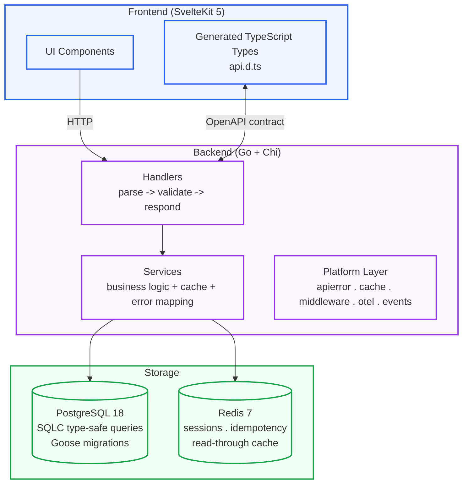

# 


Property management system. Go backend, SvelteKit 5 frontend, PostgreSQL 18.
Type-safe from database to browser. No ORM, no CSS framework.

## Table of Contents

- [Quick start](#quick-start)
- [Architecture](#architecture)
- [Tech stack](#tech-stack)
- [Design decisions](#design-decisions)
- [Testing & quality](#testing--quality)
- [Documentation](#documentation)

---

## Quick start

```bash
git clone https://github.com/mally/yop-pms
cd yop-pms
make setup          # tools, .env, npm deps
make db-up          # PostgreSQL 18 + Redis 7
make dev            # Go hot-reload (Air) + SvelteKit (Vite) concurrently
```

**Prerequisites:** Go 1.23+, Node.js 22+, Docker.

After `make db-up`:

- API: [`http://localhost:8080`](http://localhost:8080)
- Swagger UI:
  [`http://localhost:8080/swagger/index.html`](http://localhost:8080/swagger/index.html)
- Frontend: [`http://localhost:5173`](http://localhost:5173)

---

## Architecture



**Key choices:**

- **Schema-first API.** Swagger annotations to OpenAPI to generated TypeScript
  types. Frontend never defines its own API types.
  ([ADR-001](./docs/adr/001-schema-first-api.md))
- **Three-layer backend.** Handlers don't touch cache or database. Services own
  data retrieval and error mapping. Store is pure SQLC generated code.
- **Reactive cache invalidation.** PostgreSQL `LISTEN/NOTIFY` invalidates Redis
  keys directly. 24h TTLs are a fallback, not the primary mechanism.
  ([ADR-010](./docs/adr/010-guest-aware-hold-ttl.md))
- **No ORM.** Raw SQL via SQLC. Type safety without abstraction overhead.
- **DB-first integrity.** Check constraints sync to backend validation _and_
  frontend TypeScript. Financials are `INTEGER` (smallest unit). UUIDv7 primary
  keys. Soft deletes with partial unique indexes.
  ([ADR-002](./docs/adr/002-core-db-principles.md))

---

## Tech stack

| Layer            | Technology          | Why                                     |
| ---------------- | ------------------- | --------------------------------------- |
| Frontend         | SvelteKit 5 (Runes) | Reactive, minimal boilerplate           |
| Backend          | Go + Chi            | Fast HTTP, zero-cost abstractions       |
| Database         | PostgreSQL 18       | ACID, window functions, `TSTZRANGE`     |
| Cache            | Redis 7             | Read-through, idempotency, sessions     |
| DB access        | SQLC                | Type-safe SQL, no ORM                   |
| Migrations       | Goose               | SQL-first migration management          |
| API contract     | OpenAPI / Swagger   | Generated TypeScript types              |
| Observability    | OpenTelemetry       | Distributed tracing, structured logging |
| Containerisation | Docker              | `scratch`-based image (~30 MB)          |
| CI/CD            | GitHub Actions      | Build, test, deploy                     |

---

## Design decisions

All decisions documented as Architecture Decision Records. See
[`docs/adr/`](./docs/adr/README.md) for the full index.

Deferred decisions (payment authorisation model, etc.) live in
[`docs/pruned/`](./docs/pruned/).

---

## Testing & quality

```bash
make test     # All tests (backend + frontend)
make audit    # go vet, govulncheck, svelte-check
make lint     # golangci-lint + Prettier
```

---

## Documentation

- [Architecture Decision Records](./docs/adr/README.md). Why each decision was
  made.
- [API Contracts](./docs/guides/api-contracts.md). Design conventions and code
  generation.
- [Database ERD](./docs/conventions/yop-pms-erd.md). Entity-relationship
  diagram.
- [Database Conventions](./docs/conventions/database.md). Schema design rules.
- [Agentic Engineering Workflow](./docs/agentic-engineering-workflow.md). 6-stage
  workflow: Role Job Spec → Research → Domain Modeling → Feature Job Spec →
  tickets → implement. Supersedes legacy `docs/requirements/` RTM format.
- [Flows](./docs/flows/). Sequence diagrams for every reservation lifecycle
  path.
