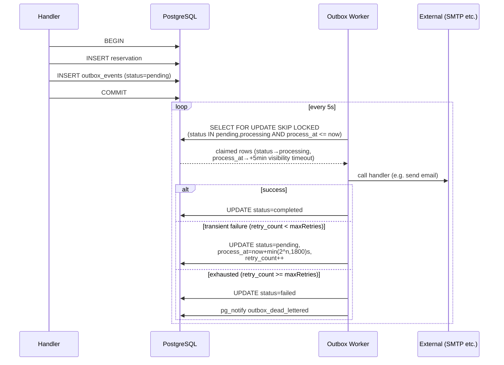

# ADR 012: Transactional Outbox Worker

## Status

**Accepted**

## Context

Certain operations triggered by a reservation mutation must reach external systems — confirmation emails, pre-arrival reminders, cancellation notices. The naive approach is to call the external service inline inside the request handler. This fails in two ways:

1. **Blocking** — SMTP and HTTP calls can take hundreds of milliseconds or time out. The guest's checkout request waits.
2. **Lost work** — If the process crashes after committing the reservation but before the email is sent, the email is never sent and there is no record it was attempted.

A background goroutine launched from the handler solves the blocking problem but not the lost-work problem — the goroutine dies with the process and there is no retry.

## Decision

We use the **transactional outbox pattern**. Handlers enqueue work by inserting a row into `internal.outbox_events` as part of the same database transaction as the domain mutation. A separate poll loop reads and delivers the work independently.

### How it works

### Visibility timeout (crash recovery)

When a row is claimed its `process_at` is set 5 minutes into the future. If the worker process crashes mid-handler, the row retains `status=processing`. On the next poll the partial index (`WHERE status IN ('pending','processing')`) exposes the row again once `process_at <= NOW()`. No separate sweep or extra column is needed.

### Retry backoff

Failed handlers are retried with `min(2^retry_count, 1800)` second backoff:

| Attempt | Delay |
|---------|-------|
| 1st retry | 1s |
| 2nd retry | 2s |
| 3rd retry | 4s |
| … | … |
| 11th+ | 1800s (30 min) |

### Dead-letter channel

Exhausted events emit `pg_notify('outbox_dead_lettered', {...})`. The event listener can subscribe to this channel to surface recurring failures in a dashboard or alert a property owner without polling the database.

## Consequences

### ✅ Positive

- **Durability** — Work is never lost; the row survives process crashes
- **Atomicity** — Reservation + outbox row commit together; no window where reservation exists but email is not queued
- **Non-blocking** — Request returns as soon as the DB transaction commits
- **Retry with backoff** — Transient SMTP outages recover automatically
- **Observable** — `internal.outbox_events` is directly queryable; status, error, retry count all visible
- **Crash-safe** — 5-minute visibility timeout reclaims rows stranded by a crashed worker without extra infrastructure
- **Dead-letter signalling** — `pg_notify` on exhaustion enables downstream monitoring without polling

### ⚠️ Negative

- **Eventual delivery** — Email arrives seconds after the reservation commits, not milliseconds. Acceptable for a PMS; unacceptable for real-time bidding.
- **Poll overhead** — One query per `pollInterval` (5s) regardless of load. At max 5 properties this is negligible.
- **Single worker** — Current design is one goroutine. If email volume grows significantly, `BatchSize` and a second worker instance can scale it; no schema change needed.
- **No ordering guarantee** — `SKIP LOCKED` picks whichever rows are available; events for the same reservation may process out of insertion order. Handlers must be idempotent and order-independent.
- **No exactly-once delivery** — A handler that succeeds but crashes before `markCompleted` commits will be retried. Handlers must be idempotent (resending a confirmation email is preferable to not sending it).

## Alternatives Considered

- **Inline goroutine** — Rejected: work is lost on process crash; no retry; no visibility.

- **Redis queue (e.g. BullMQ, asynq)** — Rejected: Redis is transient state only (ADR-008). An enqueue that succeeds but whose corresponding DB transaction rolls back leaves a phantom task. Atomicity between domain mutation and task creation requires the same data store.

- **Dedicated message broker (RabbitMQ, NATS)** — Rejected: adds infra dependency for a PMS serving 5 hotels. The transactional outbox delivers the same durability guarantee with only PostgreSQL, which is already required.

- **PostgreSQL `LISTEN/NOTIFY` as the delivery mechanism** — Rejected for this use case: `pg_notify` has no persistence. If the worker is restarting when the notification fires, the event is lost. Outbox rows survive the worker being down.

## References

- `internal/platform/worker/` — Worker engine implementation (see package comment for usage)
- `internal/store/queries/worker.sql` — SQLC enqueue query
- `migrations/00006_outbox_worker.sql` — Schema: `internal.outbox_events`
- ADR-008: Redis Caching Layer (why Redis is not used for queuing)
- ADR-010: Reactive Cache Invalidation (the `LISTEN/NOTIFY` infrastructure reused by dead-letter signalling)
