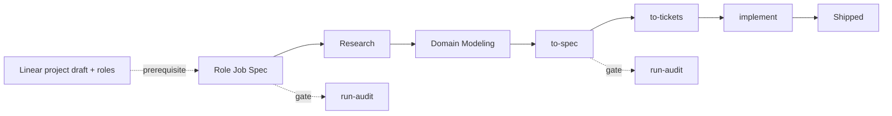
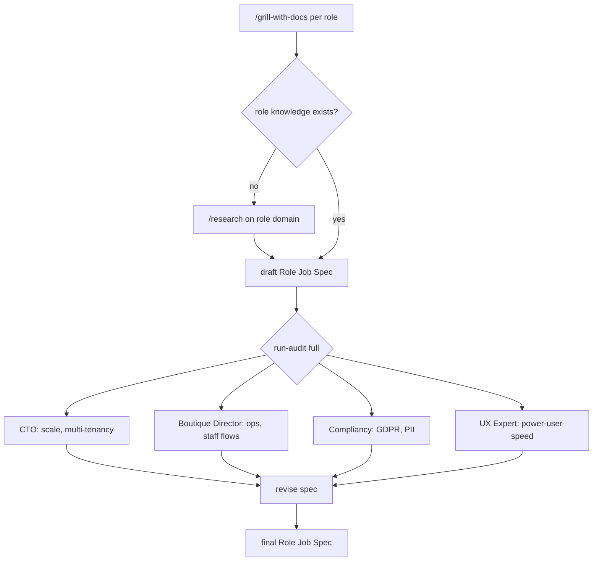
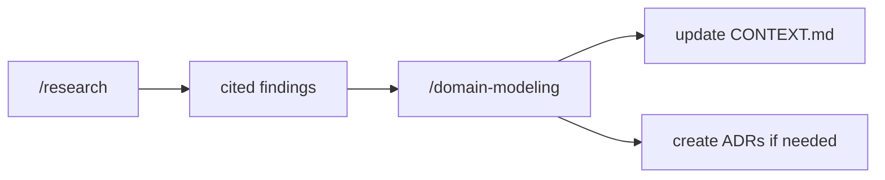
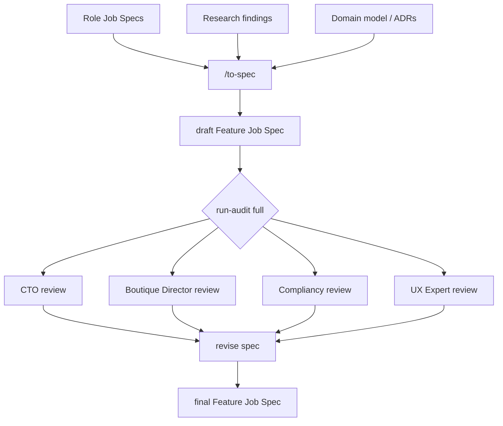
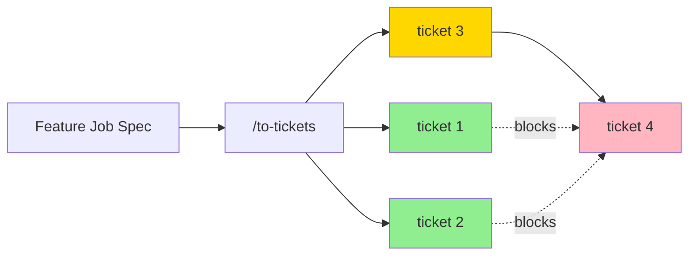
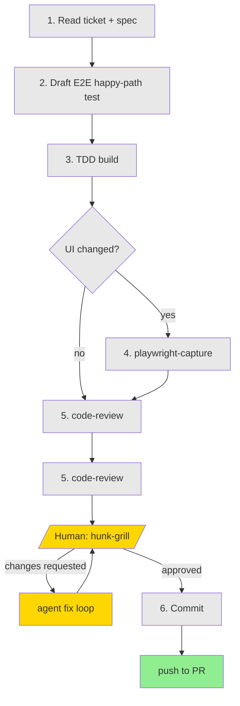
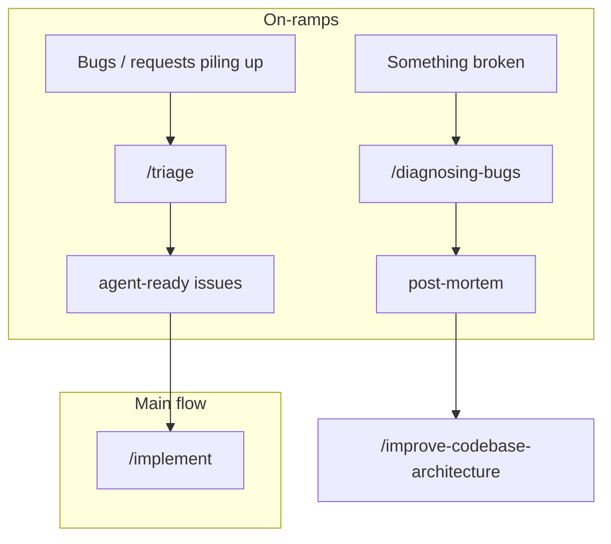
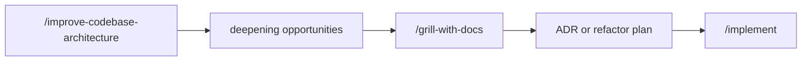

# Agentic Engineering Workflow

Yop PMS uses a 6-stage agentic workflow from idea to shipped feature. Each stage is a skill invocation — the agent drives, human gates at key points.

Use `/ask-yop` at any point for guidance on which skill or stage to invoke next.

## Pipeline Overview

Prerequisite: a draft Linear project with the roles this feature affects. Roles determine which Role Job Specs to create.

## Stage 1: Role Job Spec

Start from the Linear project draft — it defines which roles this feature affects. Those roles determine what to research and write specs for. Capture domain knowledge per role before feature planning. If no knowledge exists for a role, research first — then interview against the domain model. Advisory review catches blind spots after the draft.

## Stage 2 and 3: Research and Domain Modeling

## Stage 4: to-spec — Feature Job Spec

Synthesize role specs, research, and domain model into a Feature Job Spec. No user stories — role-grouped requirements format. Advisory review gates before ticket creation.

## Stage 5: to-tickets

Break Feature Job Spec into vertical tracer-bullet tickets with blocking edges. Each ticket is a narrow but complete path through every layer.

Green = frontier (takeable now). Yellow = in progress. Red = blocked.

## Stage 6: implement

Build one ticket at a time. Agent drives 6 steps autonomously. Single human gate after commit.

Grey = agent-driven. Yellow = human-in-the-loop. Green = done.

Parallel tickets run in separate Git worktrees. Clear context between tickets.

## On-ramps

Two paths merge onto the main flow:

## Codebase Health

## Skill Map

| Category | Skills | Location |
|----------|--------|----------|
| Workflow | grilling, grill-with-docs, grill-me, research, domain-modeling, to-spec, to-tickets, implement, tdd, code-review, prototype, handoff | `.agents/skills/engineering/` |
| Health | codebase-design, diagnosing-bugs, improve-codebase-architecture | `.agents/skills/health/` |
| Process | wayfinder, triage | `.agents/skills/process/` |
| Learn | teach, writing-great-skills | `.agents/skills/learn/` |
| Yop overrides | to-spec, implement, playwright-capture | `.agents/skills/yop/` |
| Yop custom | ask-yop (router), run-audit (advisory review) | `.pi/skills/` |

## Context Hygiene

- Stages 1 through 4 in one unbroken context window — do not compact until after to-tickets
- Each implement starts fresh from the ticket
- Limit: smart zone (~120k tokens)
