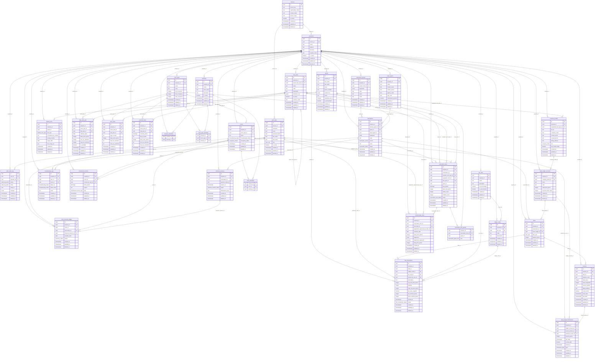

# The Heart of the Project

```mermaid
erDiagram
    %% Auth Schema
    auth_users {
        uuid id PK
        uuid licence_id FK
        text username
        text email
        text password_hash
        text first_name
        text last_name
        user_role role
        boolean is_active
        timestamptz created_at
        timestamptz updated_at
        timestamptz deleted_at
    }

    auth_audit_logs {
        uuid id PK
        uuid user_id FK
        uuid property_id FK
        audit_log_action action
        audit_log_entity entity
        uuid entity_id
        jsonb changes
        timestamptz created_at
        timestamptz updated_at
        timestamptz deleted_at
    }

    %% Operations Schema
    licences {
        uuid id PK
        text licence_key
        text organisation_name
        text contact_email
        text licence_notes
        boolean is_active
        timestamptz created_at
        timestamptz updated_at
        timestamptz deleted_at
    }

    properties {
        uuid id PK
        uuid licence_id FK
        text name
        text address
        text timezone
        text property_notes
        boolean is_active
        timestamptz created_at
        timestamptz updated_at
        timestamptz deleted_at
    }

    reservations {
        uuid id PK
        uuid property_id FK
        uuid primary_guest_id FK
        uuid group_id FK
        uuid travel_agent_id FK
        serial sequential
        text code
        reservation_source source
        text notes
        reservation_status status
        timestamptz created_at
        timestamptz updated_at
        timestamptz deleted_at
    }

    reservation_groups {
        uuid id PK
        uuid property_id FK
        uuid master_folio_id FK
        serial sequential
        text code
        text name
        text notes
        timestamptz created_at
        timestamptz updated_at
        timestamptz deleted_at
    }

    reservation_items {
        uuid id PK
        uuid property_id FK
        uuid reservation_id FK
        uuid booked_room_type_id FK
        uuid assigned_room_id FK
        uuid rate_plan_id FK
        uuid guest_id FK
        tstzrange stay_period
        integer base_rate_pence
        integer adults_count
        integer children_count
        reservation_item_status status
        timestamptz created_at
        timestamptz updated_at
        timestamptz deleted_at
    }

    checkout_sessions {
        uuid id PK
        uuid property_id FK
        uuid reservation_id FK
        text payment_intent_id
        timestamptz expires_at
        checkout_session_status status
        text idempotency_key
        timestamptz created_at
        timestamptz updated_at
        timestamptz deleted_at
    }

    amenities {
        uuid id PK
        uuid property_id FK
        text name
        text short_code
        text description
        boolean is_active
        timestamptz created_at
        timestamptz updated_at
        timestamptz deleted_at
    }

    %% Inventory Schema
    rooms {
        uuid id PK
        uuid property_id FK
        uuid room_type_id FK
        text name
        housekeeping_status housekeeping_status
        occupancy_status occupancy_status
        timestamptz created_at
        timestamptz updated_at
        timestamptz deleted_at
    }

    room_types {
        uuid id PK
        uuid property_id FK
        text name
        text code
        integer std_occupancy
        integer min_occupancy
        integer max_occupancy
        timestamptz created_at
        timestamptz updated_at
        timestamptz deleted_at
    }

    room_inventory_ledger {
        uuid id PK
        uuid property_id FK
        uuid room_id FK
        uuid reservation_id FK
        uuid checkout_session_id FK
        date calendar_date
        inventory_status status
        timestamptz created_at
        timestamptz updated_at
        timestamptz deleted_at
    }

    housekeeping_logs {
        uuid id PK
        uuid property_id FK
        uuid user_id FK
        uuid room_id FK
        housekeeping_status status_to
        housekeeping_status status_from
        text notes
        timestamptz created_at
        timestamptz updated_at
        timestamptz deleted_at
    }

    maintenance_blocks {
        uuid id PK
        uuid property_id FK
        uuid room_id FK
        uuid created_by_user_id FK
        tstzrange block_period
        text reason
        maintenance_block_type type
        timestamptz created_at
        timestamptz updated_at
        timestamptz deleted_at
    }

    %% Identity Schema
    guests {
        uuid id PK
        uuid property_id FK
        text first_name
        text last_name
        text email
        text phone_number
        jsonb preferences
        text notes
        boolean marketing_opt_in
        boolean is_anonymised
        timestamptz created_at
        timestamptz updated_at
        timestamptz deleted_at
    }

    identity_docs {
        uuid id PK
        uuid property_id FK
        uuid guest_id FK
        identity_doc_type doc_type
        text encrypted_doc_number
        text issuing_country
        date expiry_date
        text doc_image_url
        timestamptz created_at
        timestamptz updated_at
        timestamptz deleted_at
    }

    company_profiles {
        uuid id PK
        uuid property_id FK
        uuid negotiated_rate_plan_id FK
        text tax_id
        text company_name
        text contact_email
        text contact_phone
        text billing_address
        company_notes text
        boolean has_credit_facility
        timestamptz created_at
        timestamptz updated_at
        timestamptz deleted_at
    }

    travel_agents {
        uuid id PK
        uuid property_id FK
        text name
        text contact_email
        text contact_phone
        text agency_notes
        text iata_code
        numeric commission_percent
        timestamptz created_at
        timestamptz updated_at
        timestamptz deleted_at
    }

    %% Finance Schema
    folios {
        uuid id PK
        uuid property_id FK
        uuid reservation_id FK
        uuid sales_ledger_id FK
        folio_part folio_part
        integer balance_pence
        timestamptz created_at
        timestamptz updated_at
        timestamptz deleted_at
    }

    folio_transactions {
        uuid id PK
        uuid property_id FK
        uuid folio_id FK
        uuid ledger_code_id FK
        uuid tax_rule_id FK
        uuid posted_by_user_id FK
        text description
        integer net_unit_price_pence
        integer quantity
        integer total_net_price_pence
        numeric tax_rate_snapshot
        integer tax_amount_pence
        integer gross_amount_pence
        timestamptz posted_at
        folio_transaction_status status
        timestamptz created_at
        timestamptz updated_at
        timestamptz deleted_at
    }

    invoices {
        uuid id PK
        uuid property_id FK
        uuid folio_id FK
        text property_code
        integer fiscal_year
        integer fiscal_sequential
        text invoice_number
        text billing_address
        boolean is_pro_forma
        timestamptz issue_date
        timestamptz due_date
        timestamptz created_at
        timestamptz updated_at
        timestamptz deleted_at
    }

    ledger_codes {
        uuid id PK
        uuid property_id FK
        uuid tax_rule FK
        text code
        text description
        timestamptz created_at
        timestamptz updated_at
        timestamptz deleted_at
    }

    tax_rules {
        uuid id PK
        uuid property_id FK
        text name
        text description
        numeric tax_percentage
        boolean is_tax_inclusive
        timestamptz created_at
        timestamptz updated_at
        timestamptz deleted_at
    }

    %% Pricing Schema
    rate_plans {
        uuid id PK
        uuid property_id FK
        uuid parent_rate_plan_id FK
        text name
        text code
        text description
        jsonb derivation_rule
        boolean is_active
        text currency_code
        timestamptz created_at
        timestamptz updated_at
        timestamptz deleted_at
    }

    daily_price_grid {
        uuid id PK
        uuid property_id FK
        uuid room_type_id FK
        uuid rate_plan_id FK
        date calendar_date
        integer base_price_pence
        integer min_los_restriction
        integer max_los_restriction
        boolean is_available
        timestamptz created_at
        timestamptz updated_at
        timestamptz deleted_at
    }

    booked_daily_rates {
        uuid id PK
        uuid property_id FK
        uuid reservation_item_id FK
        uuid rate_plan_id FK
        uuid adjustment_approved_by_user_id FK
        date calendar_date
        integer base_price_pence
        jsonb adjustment
        boolean adjustment_approved
        integer final_price_pence
        timestamptz created_at
        timestamptz updated_at
        timestamptz deleted_at
    }

    base_rates {
        uuid id PK
        uuid property_id FK
        uuid room_type_id FK
        uuid rate_plan_id FK
        int day_of_week
        integer base_price_pence
        int min_los_restriction
        int max_los_restriction
        timestamptz created_at
        timestamptz updated_at
        timestamptz deleted_at
    }

    seasonal_rates {
        uuid id PK
        uuid property_id FK
        uuid room_type_id FK
        uuid rate_plan_id FK
        tstzrange override_period
        int day_of_week
        integer base_price_pence
        int min_los_restriction
        int max_los_restriction
        timestamptz created_at
        timestamptz updated_at
        timestamptz deleted_at
    }

    %% Sales Ledgers Schema
    sales_ledger_accounts {
        uuid id PK
        uuid property_id FK
        uuid company_profile_id FK
        text name
        text code
        integer credit_limit_pence
        integer payment_terms_days
        timestamptz created_at
        timestamptz updated_at
        timestamptz deleted_at
    }

    sales_ledger_transactions {
        uuid id PK
        uuid property_id FK
        uuid ledger_account_id FK
        uuid source_invoice_id FK
        uuid posted_by_user_id FK
        integer amount_pence
        timestamptz due_date
        boolean is_fully_paid
        timestamptz posted_at
        transaction_type type
        timestamptz created_at
        timestamptz updated_at
        timestamptz deleted_at
    }

    %% Junction Tables
    property_amenities {
        uuid property_id PK
        uuid amenity_id PK
    }

    room_amenities {
        uuid property_id FK
        uuid room_id PK
        uuid amenity_id PK
    }

    room_type_amenities {
        uuid property_id FK
        uuid room_type_id PK
        uuid amenity_id PK
    }

    reservation_item_guests {
        uuid property_id FK
        uuid reservation_item_id PK
        uuid guest_id PK
        reservation_guest_role role
    }

    %% RELATIONSHIPS
    licences ||--o{ auth_users : "licence_id"
    licences ||--o{ properties : "licence_id"
    
    properties ||--o{ auth_audit_logs : "property_id"
    properties ||--o{ reservations : "property_id"
    properties ||--o{ reservation_groups : "property_id"
    properties ||--o{ reservation_items : "property_id"
    properties ||--o{ checkout_sessions : "property_id"
    properties ||--o{ amenities : "property_id"
    properties ||--o{ rooms : "property_id"
    properties ||--o{ room_types : "property_id"
    properties ||--o{ room_inventory_ledger : "property_id"
    properties ||--o{ housekeeping_logs : "property_id"
    properties ||--o{ maintenance_blocks : "property_id"
    properties ||--o{ guests : "property_id"
    properties ||--o{ identity_docs : "property_id"
    properties ||--o{ company_profiles : "property_id"
    properties ||--o{ travel_agents : "property_id"
    properties ||--o{ folios : "property_id"
    properties ||--o{ folio_transactions : "property_id"
    properties ||--o{ invoices : "property_id"
    properties ||--o{ ledger_codes : "property_id"
    properties ||--o{ tax_rules : "property_id"
    properties ||--o{ rate_plans : "property_id"
    properties ||--o{ daily_price_grid : "property_id"
    properties ||--o{ booked_daily_rates : "property_id"
    properties ||--o{ sales_ledger_accounts : "property_id"
    properties ||--o{ sales_ledger_transactions : "property_id"
    properties ||--o{ base_rates : "property_id"
    properties ||--o{ seasonal_rates : "property_id"

    auth_users ||--o{ auth_audit_logs : "user_id"
    auth_users ||--o{ housekeeping_logs : "user_id"
    auth_users ||--o{ maintenance_blocks : "created_by_user_id"
    auth_users ||--o{ folio_transactions : "posted_by_user_id"
    auth_users ||--o{ booked_daily_rates : "adjustment_approved_by_user_id"
    auth_users ||--o{ sales_ledger_transactions : "posted_by_user_id"

    reservations ||--o{ reservation_items : "reservation_id"
    reservations ||--o{ checkout_sessions : "reservation_id"
    reservations ||--o{ room_inventory_ledger : "reservation_id"
    reservations ||--o{ folios : "reservation_id"

    reservation_groups ||--o{ reservations : "group_id"
    travel_agents ||--o{ reservations : "travel_agent_id"
    guests ||--o{ reservations : "primary_guest_id"
    guests ||--o{ reservation_items : "guest_id"
    guests ||--o{ identity_docs : "guest_id"

    room_types ||--o{ rooms : "room_type_id"
    room_types ||--o{ reservation_items : "booked_room_type_id"
    room_types ||--o{ daily_price_grid : "room_type_id"
    room_types ||--o{ base_rates : "room_type_id"
    room_types ||--o{ seasonal_rates : "room_type_id"

    rooms ||--o{ reservation_items : "assigned_room_id"
    rooms ||--o{ room_inventory_ledger : "room_id"
    rooms ||--o{ housekeeping_logs : "room_id"
    rooms ||--o{ maintenance_blocks : "room_id"

    rate_plans ||--o{ reservation_items : "rate_plan_id"
    rate_plans ||--o{ company_profiles : "negotiated_rate_plan_id"
    rate_plans ||--o{ rate_plans : "parent_rate_plan_id"
    rate_plans ||--o{ daily_price_grid : "rate_plan_id"
    rate_plans ||--o{ booked_daily_rates : "rate_plan_id"
    rate_plans ||--o{ base_rates : "rate_plan_id"
    rate_plans ||--o{ seasonal_rates : "rate_plan_id"

    folios ||--o{ folio_transactions : "folio_id"
    folios ||--o{ invoices : "folio_id"
    
    tax_rules ||--o{ folio_transactions : "tax_rule_id"
    tax_rules ||--o{ ledger_codes : "tax_rule"
    ledger_codes ||--o{ folio_transactions : "ledger_code_id"

    sales_ledger_accounts ||--o{ folios : "sales_ledger_id"
    sales_ledger_accounts ||--o{ sales_ledger_transactions : "ledger_account_id"
    company_profiles ||--o{ sales_ledger_accounts : "company_profile_id"
    invoices ||--o{ sales_ledger_transactions : "source_invoice_id"

    checkout_sessions ||--o{ room_inventory_ledger : "checkout_session_id"
    reservation_items ||--o{ booked_daily_rates : "reservation_item_id"

    %% Junction Table Links
    properties ||--o{ property_amenities : ""
    amenities ||--o{ property_amenities : ""
    rooms ||--o{ room_amenities : ""
    amenities ||--o{ room_amenities : ""
    room_types ||--o{ room_type_amenities : ""
    amenities ||--o{ room_type_amenities : ""
    reservation_items ||--o{ reservation_item_guests : ""
    guests ||--o{ reservation_item_guests : ""
```