# Reservation Flows

Sequence diagrams for every significant reservation lifecycle path. Each diagram
maps to one or more edge cases in `docs/requirements/reservations.md §8`.

> **`stay_period` time semantics (ADR-018).** Bounds are TSTZRANGE values pinned
> to property `default_checkin_time` (lower) and `default_checkout_time` (upper)
> — **not** midnight. API request bodies accept `arrival_date`/`departure_date`
> as DATE; server composes the range. Same-day turnover protection emerges from
> the gap between checkout and check-in times. `housekeeping_buffer_minutes` is
> advisory only.

Idempotency

> **Idempotency-Key handling.** All POST/PATCH endpoints share an
> `Idempotency-Key` middleware (R-RES-VALID-004). Concurrent retries with the
> same key receive `409 IDEMPOTENCY_IN_PROGRESS` (R-RES-EDGE-044). Diagrams show
> the Redis SET NX step where it makes the flow easier to follow but it is the
> same middleware in every case.

Cache decision

> **Per-reservation Redis cache.** Individual reservation objects are NOT cached
> by ID. Availability cache (`cache:availability:*`) and idempotency keys remain
> in Redis. All mutations emit `NOTIFY reservation_changes` for reactive
> frontend updates (ADR-010, ADR-017).

Defer

> **`payment_authorization` table.** Currently `operations.checkout_sessions` in
> schema. M8 migration renames to `operations.payment_authorizations` (ADR-019,
> deferred to finance PR). Flows use the canonical post-M8 name.

## Table of Contents

- [1. Creation Flows](#1-creation-flows)
  - [1.1 Website hold → payment success → confirmed](#11-website-hold-payment-success-confirmed)
  - [1.2 Website hold → abandoned → auto-cancelled](#12-website-hold-abandoned-auto-cancelled)
  - [1.3 Internal (staff) hold → confirmed](#13-internal-staff-hold-confirmed)
  - [1.4 Walk-in → checked_in (atomic)](#14-walk-in-checked_in-atomic)
  - [1.5 OTA inbound → async worker → confirmed](#15-ota-inbound-async-worker-confirmed)
  - [1.6 Website booking → stale availability → conflict with suggestions](#16-website-booking-stale-availability-conflict-with-suggestions)
- [2. Mutation Flows](#2-mutation-flows)
  - [2.1 Item date change](#21-item-date-change)
  - [2.2 Room assignment / reassignment](#22-room-assignment--reassignment)
  - [2.3 Post-checkin room move](#23-post-checkin-room-move)
  - [2.4 Metadata update](#24-metadata-update)
  - [2.5 Mid-stay room type change](#25-mid-stay-room-type-change)
  - [2.6 Rate change during stay](#26-rate-change-during-stay)
  - [2.7 Add item to existing reservation](#27-add-item-to-existing-reservation)
  - [2.8 Rate adjustment (discount / surcharge)](#28-rate-adjustment-discount--surcharge)
- [3. Check-in / Check-out](#3-check-in-check-out)
  - [3.1 Whole-reservation check-in](#31-whole-reservation-check-in)
  - [3.2 Per-item check-in (partial, multi-room)](#32-per-item-check-in-partial-multi-room)
  - [3.3 Whole-reservation check-out](#33-whole-reservation-check-out)
  - [3.4 Early check-out (stay period shortened)](#34-early-check-out-stay-period-shortened)
  - [3.5 Batch item status update (207 Multi-Status)](#35-batch-item-status-update-207-multi-status)
  - [3.6 Overstay detection and resolution](#36-overstay-detection-and-resolution)
- [4. Terminal Flows](#4-terminal-flows)
  - [4.1 Cancellation with fee](#41-cancellation-with-fee)
  - [4.2 Cancellation with waived fee](#42-cancellation-with-waived-fee)
  - [4.3 No-show — manual](#43-no-show--manual)
  - [4.4 No-show — dashboard reminder](#44-no-show--dashboard-reminder)
  - [4.5 Reactivation — availability pass](#45-reactivation--availability-pass)
  - [4.6 Item-level cancel (multi-room)](#46-item-level-cancel-multi-room)
  - [4.7 Concurrent cancel + update race](#47-concurrent-cancel--update-race)
- [5. Background Workers](#5-background-workers)
  - [5.1 Hold expiry sweep (R-RES-INTEG-007)](#51-hold-expiry-sweep-r-res-integ-007)
  - [5.2 Archival sweep (R-RES-INTEG-008)](#52-archival-sweep-r-res-integ-008)
- [6. Availability Check](#6-availability-check)
  - [6.1 Happy path](#61-happy-path)
  - [6.2 Conflict path (R-RES-AVAIL-006)](#62-conflict-path-r-res-avail-006)
  - [6.3 Concurrent booking race (R-RES-EDGE-047)](#63-concurrent-booking-race-r-res-edge-047)
- [7. Inventory Conflicts](#7-inventory-conflicts)
  - [7.1 Maintenance block rejected by active reservation (R-RES-EDGE-008)](#71-maintenance-block-rejected-by-active-reservation-r-res-edge-008)

**Participant legend (consistent across all diagrams)**

| Participant       | Represents                               |
| ----------------- | ---------------------------------------- |
| `Staff` / `Guest` | Human actor (browser/tablet)             |
| `API`             | Go HTTP handler                          |
| `DB`              | PostgreSQL (all schemas)                 |
| `Redis`           | Cache + idempotency store                |
| `Worker`          | Background worker (outbox / TTL / sweep) |
| `Ext`             | External system (SMTP, payment provider) |

---

## 1. Creation Flows

### 1.1 Website hold → payment success → confirmed

Guest books via website. Reservation born in `hold`. Payment intent created. On
payment success, reservation transitions to `confirmed`.

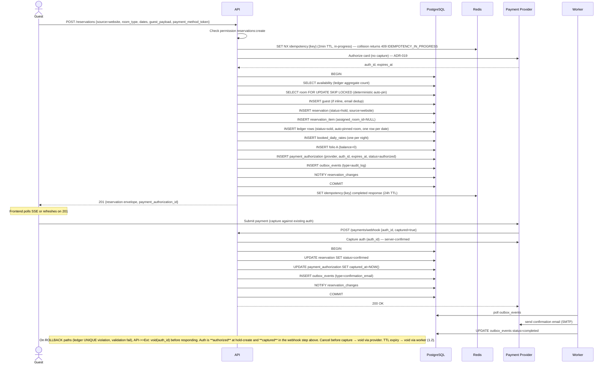
```mermaid
sequenceDiagram
    actor Guest
    participant API
    participant DB as PostgreSQL
    participant Redis
    participant Ext as Payment Provider
    participant Worker

    Guest->>API: POST /reservations {source=website, room_type, dates, guest_payload, payment_method_token}
    API->>API: Check permission reservations:create
    API->>Redis: SET NX idempotency:{key} (2min TTL, in-progress) — collision returns 409 IDEMPOTENCY_IN_PROGRESS
    API->>Ext: Authorize card (no capture) — ADR-019
    Ext-->>API: auth_id, expires_at
    API->>DB: BEGIN
    API->>DB: SELECT availability (ledger aggregate count)
    API->>DB: SELECT room FOR UPDATE SKIP LOCKED (deterministic auto-pin)
    API->>DB: INSERT guest (if inline, email dedup)
    API->>DB: INSERT reservation (status=hold, source=website)
    API->>DB: INSERT reservation_item (assigned_room_id=NULL)
    API->>DB: INSERT ledger rows (status=sold, auto-pinned room, one row per date)
    API->>DB: INSERT booked_daily_rates (one per night)
    API->>DB: INSERT folio A (balance=0)
    API->>DB: INSERT payment_authorization (provider, auth_id, expires_at, status=authorized)
    API->>DB: INSERT outbox_events (type=audit_log)
    API->>DB: NOTIFY reservation_changes
    API->>DB: COMMIT
    API->>Redis: SET idempotency:{key} completed response (24h TTL)
    API-->>Guest: 201 {reservation envelope, payment_authorization_id}

    Note over Guest: Frontend polls SSE or refreshes on 201

    Guest->>Ext: Submit payment (capture against existing auth)
    Ext->>API: POST /payments/webhook {auth_id, captured=true}
    API->>Ext: Capture auth (auth_id) — server-confirmed
    API->>DB: BEGIN
    API->>DB: UPDATE reservation SET status=confirmed
    API->>DB: UPDATE payment_authorization SET captured_at=NOW()
    API->>DB: INSERT outbox_events (type=confirmation_email)
    API->>DB: NOTIFY reservation_changes
    API->>DB: COMMIT
    API-->>Ext: 200 OK

    Worker->>DB: poll outbox_events
    Worker->>Ext: send confirmation email (SMTP)
    Worker->>DB: UPDATE outbox_events status=completed

    Note over API: On ROLLBACK paths (ledger UNIQUE violation, validation fail), API->>Ext: void(auth_id) before responding. Auth is **authorized** at hold-create and **captured** in the webhook step above. Cancel before capture → void via provider. TTL expiry → void via worker (1.2).
```

---

### 1.2 Website hold → abandoned → auto-cancelled

Guest starts booking but never completes payment. The website hold exists
specifically to lock the room during the short window between card authorization
and payment capture — preventing another guest booking the same room while the
first is entering card details. `website_hold_ttl_seconds` (property_settings)
controls the window. Worker cancels and voids the authorization on expiry.

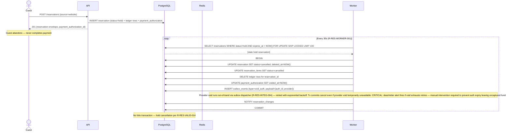
```mermaid
sequenceDiagram
    actor Guest
    participant API
    participant DB as PostgreSQL
    participant Redis
    participant Worker

    Guest->>API: POST /reservations {source=website}
    API->>DB: INSERT reservation (status=hold) + ledger rows + payment_authorization
    API-->>Guest: 201 {reservation envelope, payment_authorization_id}

    Note over Guest: Guest abandons — never completes payment

    loop Every 30s (R-RES-WORKER-001)
        Worker->>DB: SELECT reservations WHERE status=hold AND expires_at < NOW() FOR UPDATE SKIP LOCKED LIMIT 100
        DB-->>Worker: [stale hold reservation]
        Worker->>DB: BEGIN
        Worker->>DB: UPDATE reservation SET status=cancelled, deleted_at=NOW()
        Worker->>DB: UPDATE reservation_items SET status=cancelled
        Worker->>DB: DELETE ledger rows for reservation_id
        Worker->>DB: UPDATE payment_authorization SET voided_at=NOW()
        Worker->>DB: INSERT outbox_events (type=void_auth, payload={auth_id, provider})
        Note over Worker: Provider void runs out-of-band via outbox dispatcher (R-RES-INTEG-004) — retried with exponential backoff. Tx commits cancel even if provider void temporarily unavailable. CRITICAL: dead-letter alert fires if void exhausts retries — manual intervention required to prevent auth expiry leaving uncaptured funds.
        Worker->>DB: NOTIFY reservation_changes
        Worker->>DB: COMMIT
    end

    Note over DB: No folio transaction — hold cancellation per R-RES-VALID-014
```

---

### 1.3 Internal (staff) hold → confirmed

Staff drags across calendar. Reservation created in `hold`, no payment. Staff
reviews and confirms.

> **Hold-as-scaffold pattern.** Because ledger rows are inserted at hold
> creation, the room is immediately blocked from website and OTA bookings. Staff
> can safely take time entering guest details before confirming — no race with
> concurrent bookings.

> **Room pre-assignment at hold.** Staff may optionally provide
> `assigned_room_id` at hold creation (e.g. guest requests a specific room). If
> provided, that room is pinned directly and `reservation_item.assigned_room_id`
> is set immediately — skipping the auto-pin step. Same availability + conflict
> check applies.

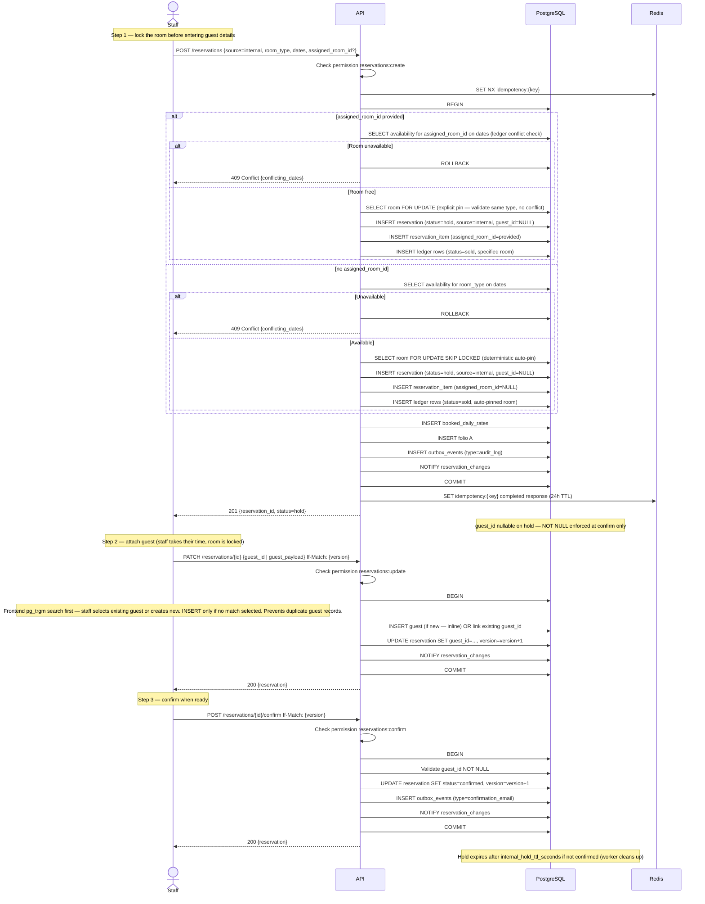
```mermaid
sequenceDiagram
    actor Staff
    participant API
    participant DB as PostgreSQL
    participant Redis

    Note over Staff: Step 1 — lock the room before entering guest details

    Staff->>API: POST /reservations {source=internal, room_type, dates, assigned_room_id?}
    API->>API: Check permission reservations:create
    API->>Redis: SET NX idempotency:{key}
    API->>DB: BEGIN
    alt assigned_room_id provided
        API->>DB: SELECT availability for assigned_room_id on dates (ledger conflict check)
        alt Room unavailable
            API->>DB: ROLLBACK
            API-->>Staff: 409 Conflict {conflicting_dates}
        else Room free
            API->>DB: SELECT room FOR UPDATE (explicit pin — validate same type, no conflict)
            API->>DB: INSERT reservation (status=hold, source=internal, guest_id=NULL)
            API->>DB: INSERT reservation_item (assigned_room_id=provided)
            API->>DB: INSERT ledger rows (status=sold, specified room)
        end
    else no assigned_room_id
        API->>DB: SELECT availability for room_type on dates
        alt Unavailable
            API->>DB: ROLLBACK
            API-->>Staff: 409 Conflict {conflicting_dates}
        else Available
            API->>DB: SELECT room FOR UPDATE SKIP LOCKED (deterministic auto-pin)
            API->>DB: INSERT reservation (status=hold, source=internal, guest_id=NULL)
            API->>DB: INSERT reservation_item (assigned_room_id=NULL)
            API->>DB: INSERT ledger rows (status=sold, auto-pinned room)
        end
    end
    API->>DB: INSERT booked_daily_rates
    API->>DB: INSERT folio A
    API->>DB: INSERT outbox_events (type=audit_log)
    API->>DB: NOTIFY reservation_changes
    API->>DB: COMMIT
    API->>Redis: SET idempotency:{key} completed response (24h TTL)
    API-->>Staff: 201 {reservation_id, status=hold}

    Note over DB: guest_id nullable on hold — NOT NULL enforced at confirm only

    Note over Staff: Step 2 — attach guest (staff takes their time, room is locked)

    Staff->>API: PATCH /reservations/{id} {guest_id | guest_payload} If-Match: {version}
    API->>API: Check permission reservations:update
    API->>DB: BEGIN
    Note over Staff: Frontend pg_trgm search first — staff selects existing guest or creates new. INSERT only if no match selected. Prevents duplicate guest records.
    API->>DB: INSERT guest (if new — inline) OR link existing guest_id
    API->>DB: UPDATE reservation SET guest_id=..., version=version+1
    API->>DB: NOTIFY reservation_changes
    API->>DB: COMMIT
    API-->>Staff: 200 {reservation}

    Note over Staff: Step 3 — confirm when ready

    Staff->>API: POST /reservations/{id}/confirm If-Match: {version}
    API->>API: Check permission reservations:confirm
    API->>DB: BEGIN
    API->>DB: Validate guest_id NOT NULL
    API->>DB: UPDATE reservation SET status=confirmed, version=version+1
    API->>DB: INSERT outbox_events (type=confirmation_email)
    API->>DB: NOTIFY reservation_changes
    API->>DB: COMMIT
    API-->>Staff: 200 {reservation}

    Note over DB: Hold expires after internal_hold_ttl_seconds if not confirmed (worker cleans up)
```

---

### 1.4 Walk-in → checked_in (atomic)

Guest arrives without prior reservation. Staff creates walk-in directly in
`checked_in`.

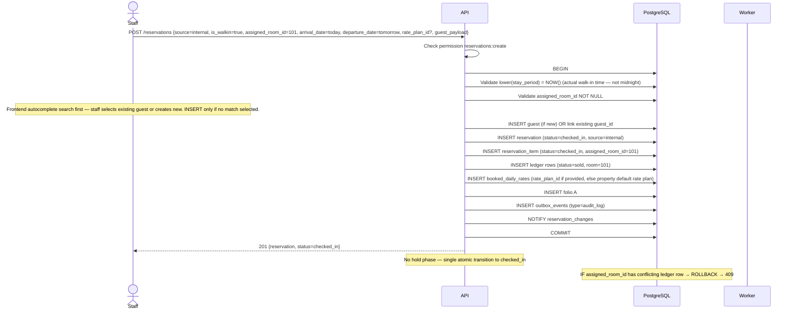
```mermaid
sequenceDiagram
    actor Staff
    participant API
    participant DB as PostgreSQL
    participant Worker

    Staff->>API: POST /reservations {source=internal, is_walkin=true, assigned_room_id=101, arrival_date=today, departure_date=tomorrow, rate_plan_id?, guest_payload}
    API->>API: Check permission reservations:create
    API->>DB: BEGIN
    API->>DB: Validate lower(stay_period) = NOW() (actual walk-in time — not midnight)
    API->>DB: Validate assigned_room_id NOT NULL
    Note over Staff: Frontend autocomplete search first — staff selects existing guest or creates new. INSERT only if no match selected.
    API->>DB: INSERT guest (if new) OR link existing guest_id
    API->>DB: INSERT reservation (status=checked_in, source=internal)
    API->>DB: INSERT reservation_item (status=checked_in, assigned_room_id=101)
    API->>DB: INSERT ledger rows (status=sold, room=101)
    API->>DB: INSERT booked_daily_rates (rate_plan_id if provided, else property default rate plan)
    API->>DB: INSERT folio A
    API->>DB: INSERT outbox_events (type=audit_log)
    API->>DB: NOTIFY reservation_changes
    API->>DB: COMMIT
    API-->>Staff: 201 {reservation, status=checked_in}

    Note over API: No hold phase — single atomic transition to checked_in
    Note over DB: IF assigned_room_id has conflicting ledger row → ROLLBACK → 409
```

---

### 1.5 OTA inbound → async worker → confirmed

> **Deferred to a future PR.** OTA channel integration is out of scope for the
> current reservation API milestone. Flow documented here for planning only.

OTA pushes reservation via signed webhook. Acked in <200ms. Worker maps payload
and creates reservation.

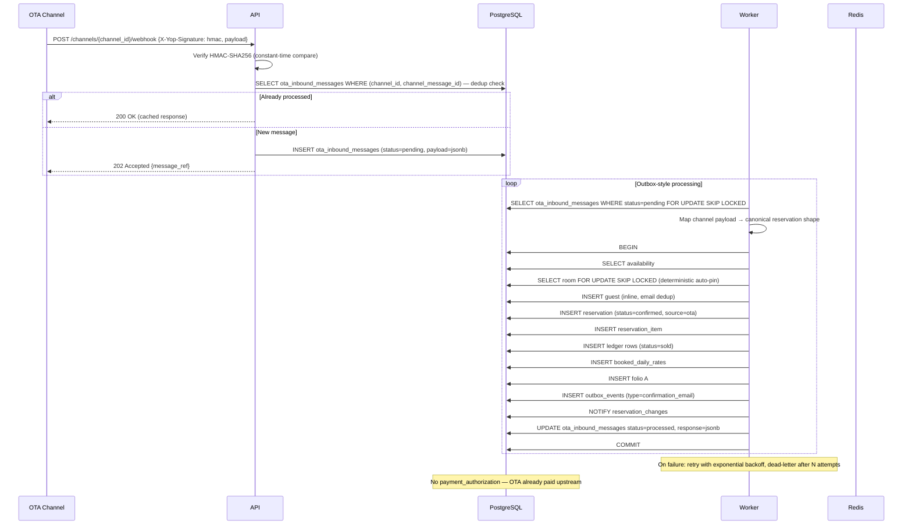
```mermaid
sequenceDiagram
    participant OTA as OTA Channel
    participant API
    participant DB as PostgreSQL
    participant Worker
    participant Redis

    OTA->>API: POST /channels/{channel_id}/webhook {X-Yop-Signature: hmac, payload}
    API->>API: Verify HMAC-SHA256 (constant-time compare)
    API->>DB: SELECT ota_inbound_messages WHERE (channel_id, channel_message_id) — dedup check
    alt Already processed
        API-->>OTA: 200 OK (cached response)
    else New message
        API->>DB: INSERT ota_inbound_messages (status=pending, payload=jsonb)
        API-->>OTA: 202 Accepted {message_ref}
    end

    loop Outbox-style processing
        Worker->>DB: SELECT ota_inbound_messages WHERE status=pending FOR UPDATE SKIP LOCKED
        Worker->>Worker: Map channel payload → canonical reservation shape
        Worker->>DB: BEGIN
        Worker->>DB: SELECT availability
        Worker->>DB: SELECT room FOR UPDATE SKIP LOCKED (deterministic auto-pin)
        Worker->>DB: INSERT guest (inline, email dedup)
        Worker->>DB: INSERT reservation (status=confirmed, source=ota)
        Worker->>DB: INSERT reservation_item
        Worker->>DB: INSERT ledger rows (status=sold)
        Worker->>DB: INSERT booked_daily_rates
        Worker->>DB: INSERT folio A
        Worker->>DB: INSERT outbox_events (type=confirmation_email)
        Worker->>DB: NOTIFY reservation_changes
        Worker->>DB: UPDATE ota_inbound_messages status=processed, response=jsonb
        Worker->>DB: COMMIT
    end

    Note over Worker: On failure: retry with exponential backoff, dead-letter after N attempts
    Note over DB: No payment_authorization — OTA already paid upstream
```

---

### 1.6 Website booking → stale availability → conflict with suggestions

Guest attempts to book based on a search result from 5 minutes ago. In the
meantime, the last room was sold. API returns 409 with alternative suggestions.

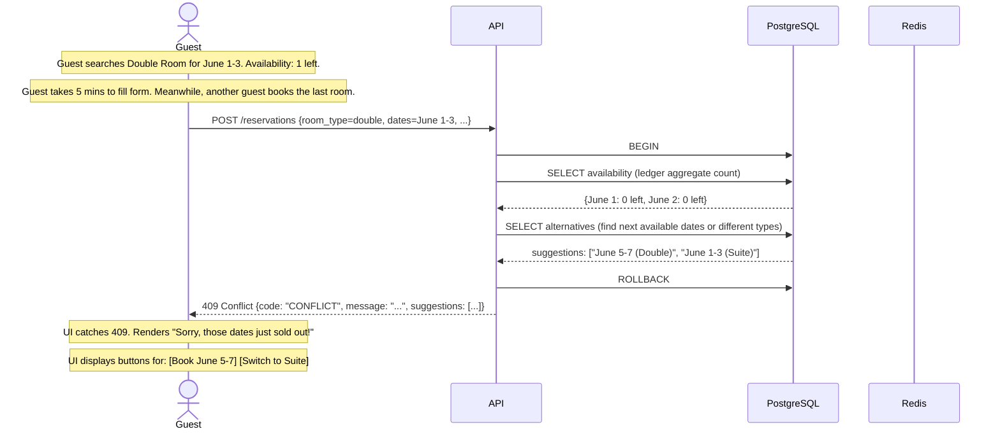
```mermaid
sequenceDiagram
    actor Guest
    participant API
    participant DB as PostgreSQL
    participant Redis

    Note over Guest: Guest searches Double Room for June 1-3. Availability: 1 left.
    Note over Guest: Guest takes 5 mins to fill form. Meanwhile, another guest books the last room.

    Guest->>API: POST /reservations {room_type=double, dates=June 1-3, ...}
    API->>DB: BEGIN
    API->>DB: SELECT availability (ledger aggregate count)
    DB-->>API: {June 1: 0 left, June 2: 0 left}

    API->>DB: SELECT alternatives (find next available dates or different types)
    DB-->>API: suggestions: ["June 5-7 (Double)", "June 1-3 (Suite)"]

    API->>DB: ROLLBACK
    API-->>Guest: 409 Conflict {code: "CONFLICT", message: "...", suggestions: [...]}

    Note over Guest: UI catches 409. Renders "Sorry, those dates just sold out!"
    Note over Guest: UI displays buttons for: [Book June 5-7] [Switch to Suite]
```

---

## 2. Mutation Flows

### 2.1 Item date change

Stay period updated. Diff-based: only ledger rows and booked_daily_rates rows
outside the new period are removed; overlapping rows are preserved. Single
transaction.

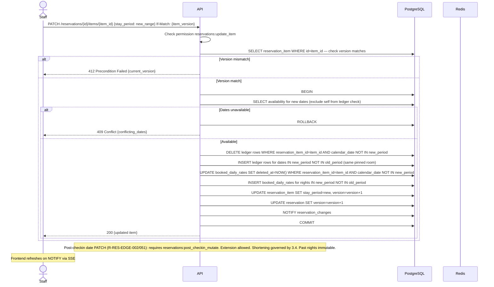
```mermaid
sequenceDiagram
    actor Staff
    participant API
    participant DB as PostgreSQL
    participant Redis

    Staff->>API: PATCH /reservations/{id}/items/{item_id} {stay_period: new_range} If-Match: {item_version}
    API->>API: Check permission reservations:update_item
    API->>DB: SELECT reservation_item WHERE id=item_id — check version matches
    alt Version mismatch
        API-->>Staff: 412 Precondition Failed {current_version}
    else Version match
        API->>DB: BEGIN
        API->>DB: SELECT availability for new dates (exclude self from ledger check)
        alt Dates unavailable
            API->>DB: ROLLBACK
            API-->>Staff: 409 Conflict {conflicting_dates}
        else Available
            API->>DB: DELETE ledger rows WHERE reservation_item_id=item_id AND calendar_date NOT IN new_period
            API->>DB: INSERT ledger rows for dates IN new_period NOT IN old_period (same pinned room)
            API->>DB: UPDATE booked_daily_rates SET deleted_at=NOW() WHERE reservation_item_id=item_id AND calendar_date NOT IN new_period
            API->>DB: INSERT booked_daily_rates for nights IN new_period NOT IN old_period
            API->>DB: UPDATE reservation_item SET stay_period=new, version=version+1
            API->>DB: UPDATE reservation SET version=version+1
            API->>DB: NOTIFY reservation_changes
            API->>DB: COMMIT
            API-->>Staff: 200 {updated item}
        end
    end

    Note over API: Post-checkin date PATCH (R-RES-EDGE-002/051): requires reservations:post_checkin_mutate. Extension allowed. Shortening governed by 3.4. Past nights immutable.
    Note over Staff: Frontend refreshes on NOTIFY via SSE
```

---

### 2.2 Room assignment / reassignment

Staff assigns or reassigns the specific room for a reservation item. Covers both
initial assignment (auto-pinned ledger slot → explicit room) and changing to a
different room of the same type pre-checkin. Post-checkin room move (guest
physically relocates) is flow 2.3.

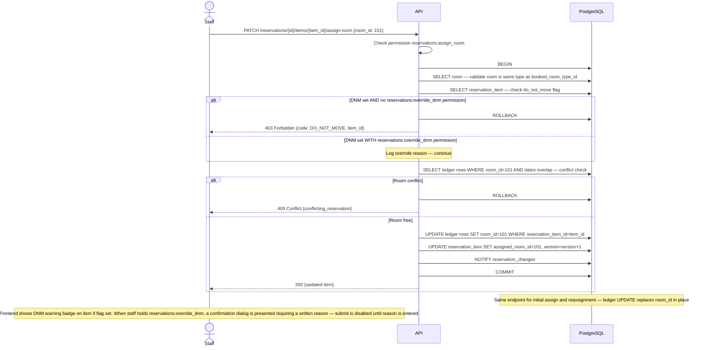
```mermaid
sequenceDiagram
    actor Staff
    participant API
    participant DB as PostgreSQL

    Staff->>API: PATCH /reservations/{id}/items/{item_id}/assign-room {room_id: 101}
    API->>API: Check permission reservations:assign_room
    API->>DB: BEGIN
    API->>DB: SELECT room — validate room is same type as booked_room_type_id
    API->>DB: SELECT reservation_item — check do_not_move flag
    alt DNM set AND no reservations:override_dnm permission
        API->>DB: ROLLBACK
        API-->>Staff: 403 Forbidden {code: DO_NOT_MOVE, item_id}
    else DNM set WITH reservations:override_dnm permission
        Note over API: Log override reason — continue
    end
    API->>DB: SELECT ledger rows WHERE room_id=101 AND dates overlap — conflict check
    alt Room conflict
        API->>DB: ROLLBACK
        API-->>Staff: 409 Conflict {conflicting_reservation}
    else Room free
        API->>DB: UPDATE ledger rows SET room_id=101 WHERE reservation_item_id=item_id
        API->>DB: UPDATE reservation_item SET assigned_room_id=101, version=version+1
        API->>DB: NOTIFY reservation_changes
        API->>DB: COMMIT
        API-->>Staff: 200 {updated item}
    end

    Note over DB: Same endpoint for initial assign and reassignment — ledger UPDATE replaces room_id in place
    Note over Staff: Frontend shows DNM warning badge on item if flag set. When staff holds reservations:override_dnm, a confirmation dialog is presented requiring a written reason — submit is disabled until reason is entered.
```

---

### 2.3 Post-checkin room move

Guest physically relocates to a different room during their stay. Requires
`reservations:post_checkin_mutate`. Same endpoint as 2.2 but permission-gated.

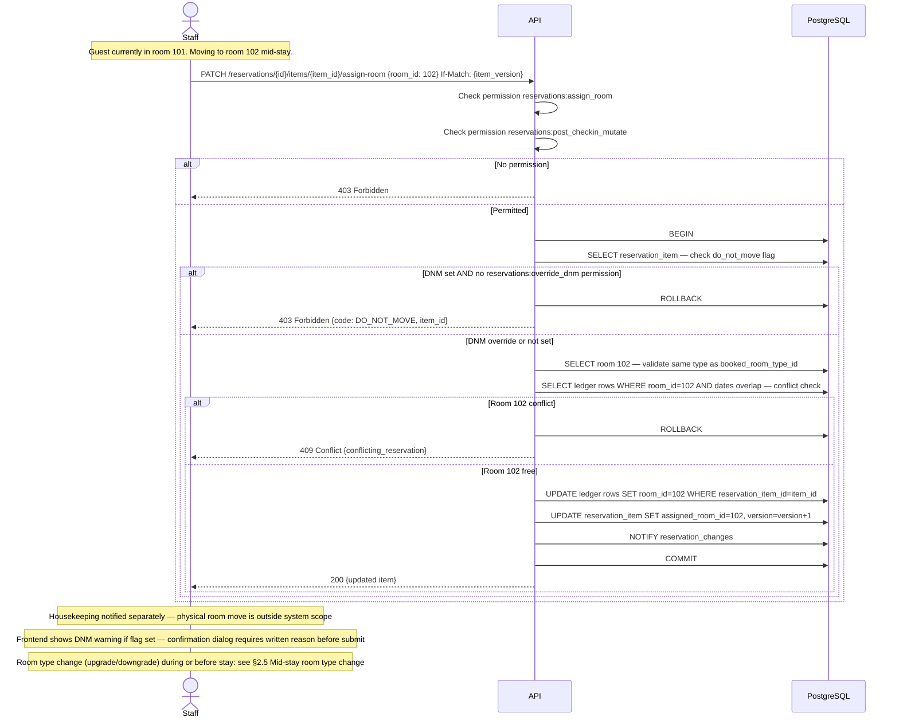
```mermaid
sequenceDiagram
    actor Staff
    participant API
    participant DB as PostgreSQL

    Note over Staff: Guest currently in room 101. Moving to room 102 mid-stay.

    Staff->>API: PATCH /reservations/{id}/items/{item_id}/assign-room {room_id: 102} If-Match: {item_version}
    API->>API: Check permission reservations:assign_room
    API->>API: Check permission reservations:post_checkin_mutate
    alt No permission
        API-->>Staff: 403 Forbidden
    else Permitted
        API->>DB: BEGIN
        API->>DB: SELECT reservation_item — check do_not_move flag
        alt DNM set AND no reservations:override_dnm permission
            API->>DB: ROLLBACK
            API-->>Staff: 403 Forbidden {code: DO_NOT_MOVE, item_id}
        else DNM override or not set
            API->>DB: SELECT room 102 — validate same type as booked_room_type_id
            API->>DB: SELECT ledger rows WHERE room_id=102 AND dates overlap — conflict check
            alt Room 102 conflict
                API->>DB: ROLLBACK
                API-->>Staff: 409 Conflict {conflicting_reservation}
            else Room 102 free
                API->>DB: UPDATE ledger rows SET room_id=102 WHERE reservation_item_id=item_id
                API->>DB: UPDATE reservation_item SET assigned_room_id=102, version=version+1
                API->>DB: NOTIFY reservation_changes
                API->>DB: COMMIT
                API-->>Staff: 200 {updated item}
            end
        end
    end

    Note over Staff: Housekeeping notified separately — physical room move is outside system scope
    Note over Staff: Frontend shows DNM warning if flag set — confirmation dialog requires written reason before submit
    Note over Staff: Room type change (upgrade/downgrade) during or before stay: see §2.5 Mid-stay room type change
```

---

### 2.4 Metadata update

Simple fields (notes, travel_agent_id, group_id, primary_guest_id). No
availability check. No ledger change.

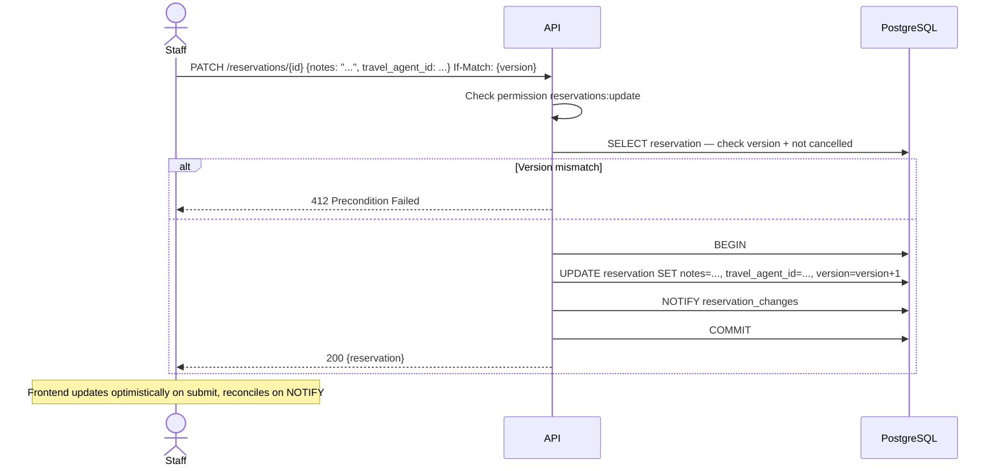
```mermaid
sequenceDiagram
    actor Staff
    participant API
    participant DB as PostgreSQL

    Staff->>API: PATCH /reservations/{id} {notes: "...", travel_agent_id: ...} If-Match: {version}
    API->>API: Check permission reservations:update
    API->>DB: SELECT reservation — check version + not cancelled
    alt Version mismatch
        API-->>Staff: 412 Precondition Failed
    else
        API->>DB: BEGIN
        API->>DB: UPDATE reservation SET notes=..., travel_agent_id=..., version=version+1
        API->>DB: NOTIFY reservation_changes
        API->>DB: COMMIT
        API-->>Staff: 200 {reservation}
    end

    Note over Staff: Frontend updates optimistically on submit, reconciles on NOTIFY
```

---

### 2.5 Mid-stay room type change

Guest upgrades or downgrades room type during their stay. Ledger split: past
dates on original room are preserved; future dates move to new type. Requires
`reservations:post_checkin_mutate`.

For pre-stay room type change: same flow without the permission guard and with
full recompute across all nights (no ledger split needed).

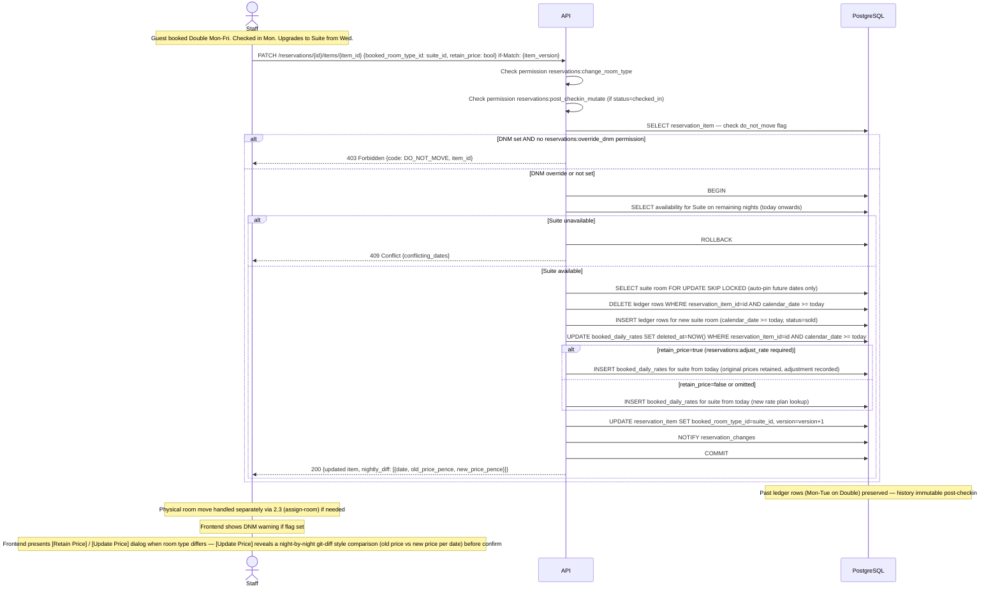
```mermaid
sequenceDiagram
    actor Staff
    participant API
    participant DB as PostgreSQL

    Note over Staff: Guest booked Double Mon-Fri. Checked in Mon. Upgrades to Suite from Wed.

    Staff->>API: PATCH /reservations/{id}/items/{item_id} {booked_room_type_id: suite_id, retain_price: bool} If-Match: {item_version}
    API->>API: Check permission reservations:change_room_type
    API->>API: Check permission reservations:post_checkin_mutate (if status=checked_in)
    API->>DB: SELECT reservation_item — check do_not_move flag
    alt DNM set AND no reservations:override_dnm permission
        API-->>Staff: 403 Forbidden {code: DO_NOT_MOVE, item_id}
    else DNM override or not set
        API->>DB: BEGIN
        API->>DB: SELECT availability for Suite on remaining nights (today onwards)
        alt Suite unavailable
            API->>DB: ROLLBACK
            API-->>Staff: 409 Conflict {conflicting_dates}
        else Suite available
            API->>DB: SELECT suite room FOR UPDATE SKIP LOCKED (auto-pin future dates only)
            API->>DB: DELETE ledger rows WHERE reservation_item_id=id AND calendar_date >= today
            API->>DB: INSERT ledger rows for new suite room (calendar_date >= today, status=sold)
            API->>DB: UPDATE booked_daily_rates SET deleted_at=NOW() WHERE reservation_item_id=id AND calendar_date >= today
            alt retain_price=true (reservations:adjust_rate required)
                API->>DB: INSERT booked_daily_rates for suite from today (original prices retained, adjustment recorded)
            else retain_price=false or omitted
                API->>DB: INSERT booked_daily_rates for suite from today (new rate plan lookup)
            end
            API->>DB: UPDATE reservation_item SET booked_room_type_id=suite_id, version=version+1
            API->>DB: NOTIFY reservation_changes
            API->>DB: COMMIT
            API-->>Staff: 200 {updated item, nightly_diff: [{date, old_price_pence, new_price_pence}]}
        end
    end

    Note over DB: Past ledger rows (Mon-Tue on Double) preserved — history immutable post-checkin
    Note over Staff: Physical room move handled separately via 2.3 (assign-room) if needed
    Note over Staff: Frontend shows DNM warning if flag set
    Note over Staff: Frontend presents [Retain Price] / [Update Price] dialog when room type differs — [Update Price] reveals a night-by-night git-diff style comparison (old price vs new price per date) before confirm
```

---

### 2.6 Rate change during stay

Staff applies a different rate plan to remaining nights. Past
`booked_daily_rates` rows are untouched (snapshot). Future rows soft-deleted and
recomputed. Rate plan daily capacity checked (M12). Pre-checkin variant: full
recompute, no permission guard.

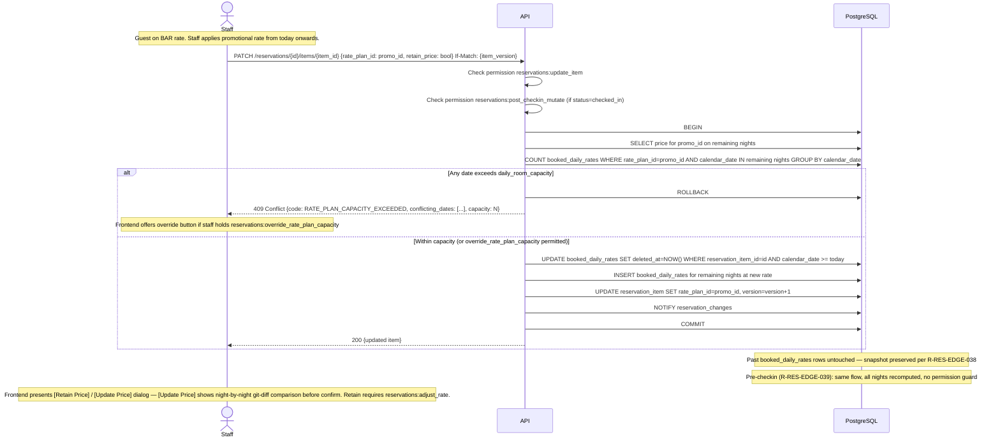
```mermaid
sequenceDiagram
    actor Staff
    participant API
    participant DB as PostgreSQL

    Note over Staff: Guest on BAR rate. Staff applies promotional rate from today onwards.

    Staff->>API: PATCH /reservations/{id}/items/{item_id} {rate_plan_id: promo_id, retain_price: bool} If-Match: {item_version}
    API->>API: Check permission reservations:update_item
    API->>API: Check permission reservations:post_checkin_mutate (if status=checked_in)
    API->>DB: BEGIN
    API->>DB: SELECT price for promo_id on remaining nights
    API->>DB: COUNT booked_daily_rates WHERE rate_plan_id=promo_id AND calendar_date IN remaining nights GROUP BY calendar_date
    alt Any date exceeds daily_room_capacity
        API->>DB: ROLLBACK
        API-->>Staff: 409 Conflict {code: RATE_PLAN_CAPACITY_EXCEEDED, conflicting_dates: [...], capacity: N}
        Note over Staff: Frontend offers override button if staff holds reservations:override_rate_plan_capacity
    else Within capacity (or override_rate_plan_capacity permitted)
        API->>DB: UPDATE booked_daily_rates SET deleted_at=NOW() WHERE reservation_item_id=id AND calendar_date >= today
        API->>DB: INSERT booked_daily_rates for remaining nights at new rate
        API->>DB: UPDATE reservation_item SET rate_plan_id=promo_id, version=version+1
        API->>DB: NOTIFY reservation_changes
        API->>DB: COMMIT
        API-->>Staff: 200 {updated item}
    end

    Note over DB: Past booked_daily_rates rows untouched — snapshot preserved per R-RES-EDGE-038
    Note over DB: Pre-checkin (R-RES-EDGE-039): same flow, all nights recomputed, no permission guard
    Note over Staff: Frontend presents [Retain Price] / [Update Price] dialog — [Update Price] shows night-by-night git-diff comparison before confirm. Retain requires reservations:adjust_rate.
```

---

### 2.7 Add item to existing reservation

Receptionist adds an extra room to an existing non-terminal reservation. Common
scenario: guest's group expands, or replacement for a previously cancelled item
(per `CONTEXT.md` — cancelled items immutable; new item appended). Requires
`reservations:add_item`.

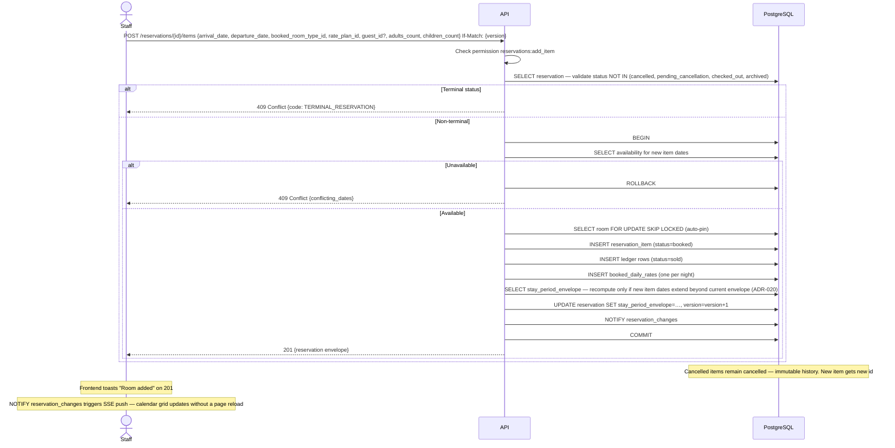
```mermaid
sequenceDiagram
    actor Staff
    participant API
    participant DB as PostgreSQL

    Staff->>API: POST /reservations/{id}/items {arrival_date, departure_date, booked_room_type_id, rate_plan_id, guest_id?, adults_count, children_count} If-Match: {version}
    API->>API: Check permission reservations:add_item
    API->>DB: SELECT reservation — validate status NOT IN (cancelled, pending_cancellation, checked_out, archived)
    alt Terminal status
        API-->>Staff: 409 Conflict {code: TERMINAL_RESERVATION}
    else Non-terminal
        API->>DB: BEGIN
        API->>DB: SELECT availability for new item dates
        alt Unavailable
            API->>DB: ROLLBACK
            API-->>Staff: 409 Conflict {conflicting_dates}
        else Available
            API->>DB: SELECT room FOR UPDATE SKIP LOCKED (auto-pin)
            API->>DB: INSERT reservation_item (status=booked)
            API->>DB: INSERT ledger rows (status=sold)
            API->>DB: INSERT booked_daily_rates (one per night)
            API->>DB: SELECT stay_period_envelope — recompute only if new item dates extend beyond current envelope (ADR-020)
            API->>DB: UPDATE reservation SET stay_period_envelope=…, version=version+1
            API->>DB: NOTIFY reservation_changes
            API->>DB: COMMIT
            API-->>Staff: 201 {reservation envelope}
        end
    end

    Note over DB: Cancelled items remain cancelled — immutable history. New item gets new id
    Note over Staff: Frontend toasts "Room added" on 201
    Note over Staff: NOTIFY reservation_changes triggers SSE push — calendar grid updates without a page reload
```

---

### 2.8 Rate adjustment (discount / surcharge)

Staff applies a discount or surcharge to one or more nights via the rate matrix
(per-night or whole-stay). Stored in
`booked_daily_rates.adjustment {type, value, reason}`. `final_price_pence`
recomputed on approval. Whole-stay adjustments are distributed across nights by
the frontend before submission — the API receives per-night rows.

Staff without `reservations:adjust_rate` may submit a pending adjustment; a
manager with the permission approves it before `final_price_pence` changes.

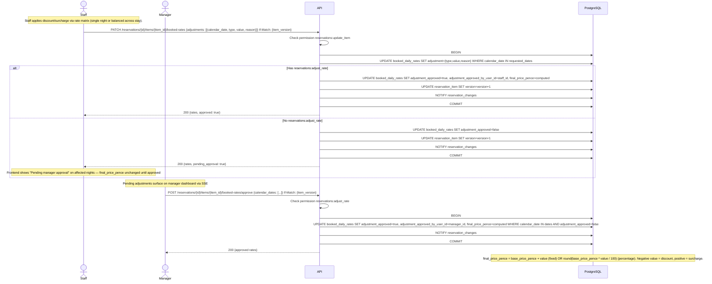
```mermaid
sequenceDiagram
    actor Staff
    actor Manager
    participant API
    participant DB as PostgreSQL

    Note over Staff: Staff applies discount/surcharge via rate matrix (single night or balanced across stay).

    Staff->>API: PATCH /reservations/{id}/items/{item_id}/booked-rates {adjustments: [{calendar_date, type, value, reason}]} If-Match: {item_version}
    API->>API: Check permission reservations:update_item
    API->>DB: BEGIN
    API->>DB: UPDATE booked_daily_rates SET adjustment={type,value,reason} WHERE calendar_date IN requested_dates

    alt Has reservations:adjust_rate
        API->>DB: UPDATE booked_daily_rates SET adjustment_approved=true, adjustment_approved_by_user_id=staff_id, final_price_pence=computed
        API->>DB: UPDATE reservation_item SET version=version+1
        API->>DB: NOTIFY reservation_changes
        API->>DB: COMMIT
        API-->>Staff: 200 {rates, approved: true}
    else No reservations:adjust_rate
        API->>DB: UPDATE booked_daily_rates SET adjustment_approved=false
        API->>DB: UPDATE reservation_item SET version=version+1
        API->>DB: NOTIFY reservation_changes
        API->>DB: COMMIT
        API-->>Staff: 200 {rates, pending_approval: true}
        Note over Staff: Frontend shows "Pending manager approval" on affected nights — final_price_pence unchanged until approved
    end

    Note over Manager: Pending adjustments surface on manager dashboard via SSE

    Manager->>API: POST /reservations/{id}/items/{item_id}/booked-rates/approve {calendar_dates: [...]} If-Match: {item_version}
    API->>API: Check permission reservations:adjust_rate
    API->>DB: BEGIN
    API->>DB: UPDATE booked_daily_rates SET adjustment_approved=true, adjustment_approved_by_user_id=manager_id, final_price_pence=computed WHERE calendar_date IN dates AND adjustment_approved=false
    API->>DB: NOTIFY reservation_changes
    API->>DB: COMMIT
    API-->>Manager: 200 {approved rates}

    Note over DB: final_price_pence = base_price_pence + value (fixed) OR round(base_price_pence * value / 100) (percentage). Negative value = discount, positive = surcharge.
```

---

## 3. Check-in / Check-out

### 3.1 Whole-reservation check-in

All items transition to `checked_in` in one call. Room assignment required on
all items.

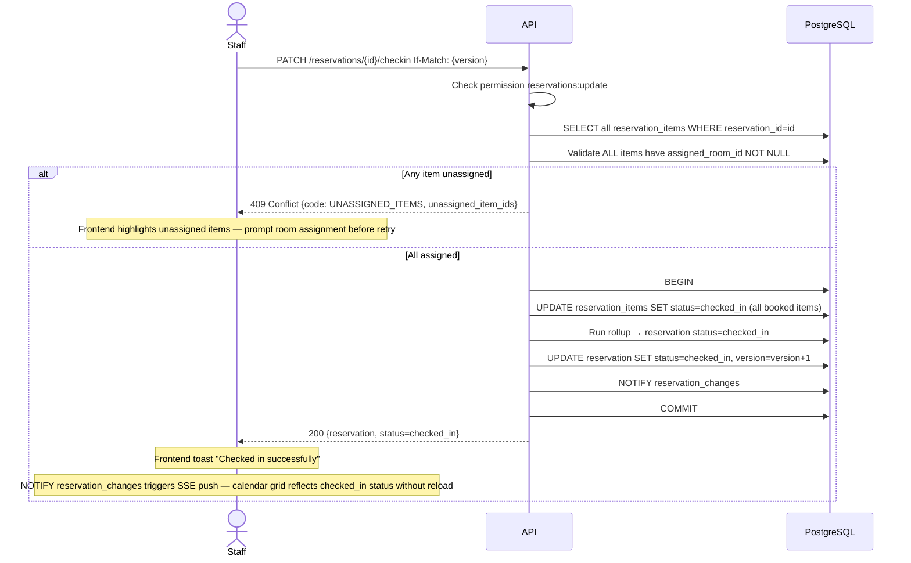
```mermaid
sequenceDiagram
    actor Staff
    participant API
    participant DB as PostgreSQL

    Staff->>API: PATCH /reservations/{id}/checkin If-Match: {version}
    API->>API: Check permission reservations:update
    API->>DB: SELECT all reservation_items WHERE reservation_id=id
    API->>DB: Validate ALL items have assigned_room_id NOT NULL
    alt Any item unassigned
        API-->>Staff: 409 Conflict {code: UNASSIGNED_ITEMS, unassigned_item_ids}
        Note over Staff: Frontend highlights unassigned items — prompt room assignment before retry
    else All assigned
        API->>DB: BEGIN
        API->>DB: UPDATE reservation_items SET status=checked_in (all booked items)
        API->>DB: Run rollup → reservation status=checked_in
        API->>DB: UPDATE reservation SET status=checked_in, version=version+1
        API->>DB: NOTIFY reservation_changes
        API->>DB: COMMIT
        API-->>Staff: 200 {reservation, status=checked_in}
        Note over Staff: Frontend toast "Checked in successfully"
        Note over Staff: NOTIFY reservation_changes triggers SSE push — calendar grid reflects checked_in status without reload
    end
```

---

### 3.2 Per-item check-in (partial, multi-room)

One guest of a two-room reservation arrives early. Item checked in
independently.

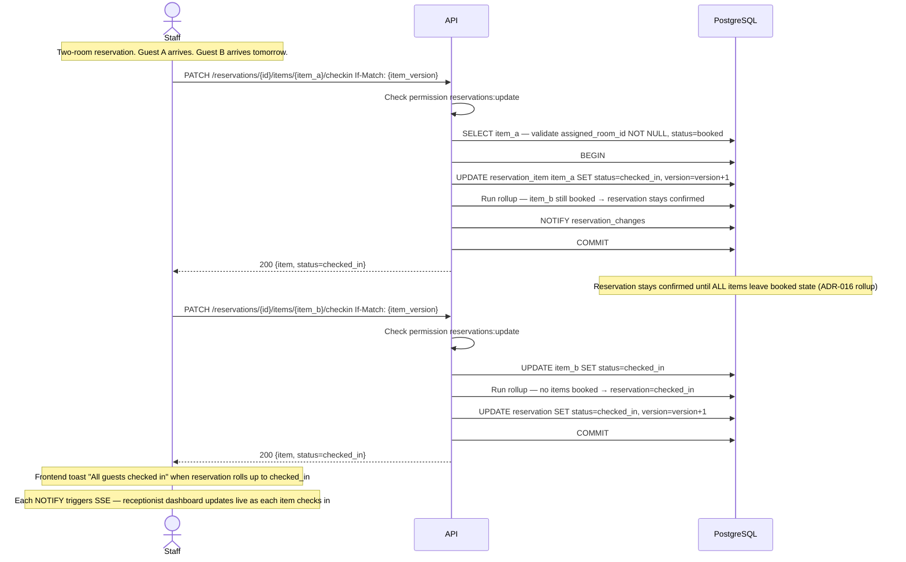
```mermaid
sequenceDiagram
    actor Staff
    participant API
    participant DB as PostgreSQL

    Note over Staff: Two-room reservation. Guest A arrives. Guest B arrives tomorrow.

    Staff->>API: PATCH /reservations/{id}/items/{item_a}/checkin If-Match: {item_version}
    API->>API: Check permission reservations:update
    API->>DB: SELECT item_a — validate assigned_room_id NOT NULL, status=booked
    API->>DB: BEGIN
    API->>DB: UPDATE reservation_item item_a SET status=checked_in, version=version+1
    API->>DB: Run rollup — item_b still booked → reservation stays confirmed
    API->>DB: NOTIFY reservation_changes
    API->>DB: COMMIT
    API-->>Staff: 200 {item, status=checked_in}

    Note over DB: Reservation stays confirmed until ALL items leave booked state (ADR-016 rollup)

    Staff->>API: PATCH /reservations/{id}/items/{item_b}/checkin If-Match: {item_version}
    API->>API: Check permission reservations:update
    API->>DB: UPDATE item_b SET status=checked_in
    API->>DB: Run rollup — no items booked → reservation=checked_in
    API->>DB: UPDATE reservation SET status=checked_in, version=version+1
    API->>DB: COMMIT
    API-->>Staff: 200 {item, status=checked_in}
    Note over Staff: Frontend toast "All guests checked in" when reservation rolls up to checked_in
    Note over Staff: Each NOTIFY triggers SSE — receptionist dashboard updates live as each item checks in
```

---

### 3.3 Whole-reservation check-out

All items transition to `checked_out`. Reservation rolls up to `checked_out`.
Folio must be settled (zero balance) before checkout is permitted.

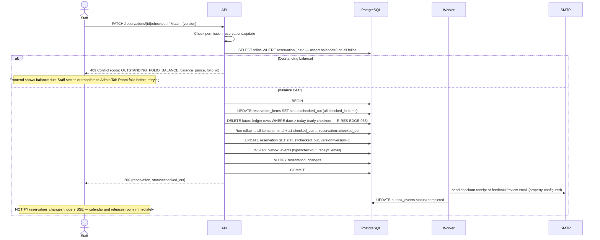
```mermaid
sequenceDiagram
    actor Staff
    participant API
    participant DB as PostgreSQL
    participant Worker
    participant Ext as SMTP

    Staff->>API: PATCH /reservations/{id}/checkout If-Match: {version}
    API->>API: Check permission reservations:update
    API->>DB: SELECT folios WHERE reservation_id=id — assert balance=0 on all folios
    alt Outstanding balance
        API-->>Staff: 409 Conflict {code: OUTSTANDING_FOLIO_BALANCE, balance_pence, folio_id}
        Note over Staff: Frontend shows balance due. Staff settles or transfers to Admin/Tab Room folio before retrying
    else Balance clear
        API->>DB: BEGIN
        API->>DB: UPDATE reservation_items SET status=checked_out (all checked_in items)
        API->>DB: DELETE future ledger rows WHERE date > today (early checkout — R-RES-EDGE-035)
        API->>DB: Run rollup → all items terminal + ≥1 checked_out → reservation=checked_out
        API->>DB: UPDATE reservation SET status=checked_out, version=version+1
        API->>DB: INSERT outbox_events (type=checkout_receipt_email)
        API->>DB: NOTIFY reservation_changes
        API->>DB: COMMIT
        API-->>Staff: 200 {reservation, status=checked_out}

        Worker->>Ext: send checkout receipt or feedback/review email (property-configured)
        Worker->>DB: UPDATE outbox_events status=completed
        Note over Staff: NOTIFY reservation_changes triggers SSE — calendar grid releases room immediately
    end
```

---

### 3.4 Early check-out (stay period shortened)

Guest leaves before scheduled departure. Future ledger rows hard-deleted
(inventory released). Future `booked_daily_rates` rows soft-deleted (financial
record preserved).

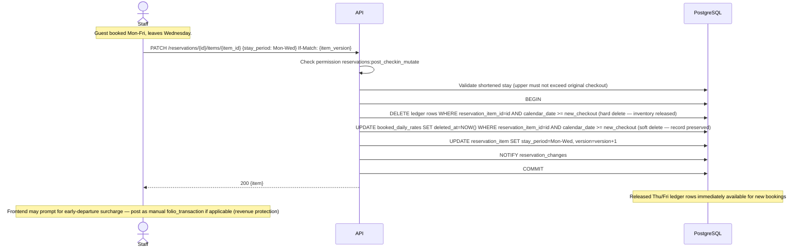
```mermaid
sequenceDiagram
    actor Staff
    participant API
    participant DB as PostgreSQL

    Note over Staff: Guest booked Mon-Fri, leaves Wednesday.

    Staff->>API: PATCH /reservations/{id}/items/{item_id} {stay_period: Mon-Wed} If-Match: {item_version}
    API->>API: Check permission reservations:post_checkin_mutate
    API->>DB: Validate shortened stay (upper must not exceed original checkout)
    API->>DB: BEGIN
    API->>DB: DELETE ledger rows WHERE reservation_item_id=id AND calendar_date >= new_checkout (hard delete — inventory released)
    API->>DB: UPDATE booked_daily_rates SET deleted_at=NOW() WHERE reservation_item_id=id AND calendar_date >= new_checkout (soft delete — record preserved)
    API->>DB: UPDATE reservation_item SET stay_period=Mon-Wed, version=version+1
    API->>DB: NOTIFY reservation_changes
    API->>DB: COMMIT
    API-->>Staff: 200 {item}

    Note over DB: Released Thu/Fri ledger rows immediately available for new bookings
    Note over Staff: Frontend may prompt for early-departure surcharge — post as manual folio_transaction if applicable (revenue protection)
```

---

### 3.5 Batch item status update (207 Multi-Status)

Whole-reservation check-in where some items are in a terminal or incompatible
state. Valid items transition; invalid items reported per-item. Single
transaction for the valid subset.

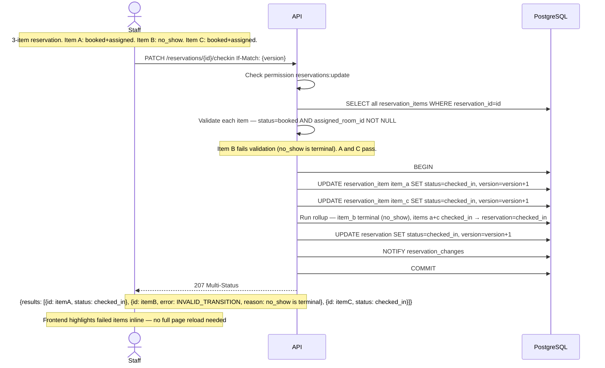
```mermaid
sequenceDiagram
    actor Staff
    participant API
    participant DB as PostgreSQL

    Note over Staff: 3-item reservation. Item A: booked+assigned. Item B: no_show. Item C: booked+assigned.

    Staff->>API: PATCH /reservations/{id}/checkin If-Match: {version}
    API->>API: Check permission reservations:update
    API->>DB: SELECT all reservation_items WHERE reservation_id=id
    API->>API: Validate each item — status=booked AND assigned_room_id NOT NULL

    Note over API: Item B fails validation (no_show is terminal). A and C pass.

    API->>DB: BEGIN
    API->>DB: UPDATE reservation_item item_a SET status=checked_in, version=version+1
    API->>DB: UPDATE reservation_item item_c SET status=checked_in, version=version+1
    API->>DB: Run rollup — item_b terminal (no_show), items a+c checked_in → reservation=checked_in
    API->>DB: UPDATE reservation SET status=checked_in, version=version+1
    API->>DB: NOTIFY reservation_changes
    API->>DB: COMMIT

    API-->>Staff: 207 Multi-Status
    Note over API,Staff: {results: [{id: itemA, status: checked_in}, {id: itemB, error: INVALID_TRANSITION, reason: no_show is terminal}, {id: itemC, status: checked_in}]}
    Note over Staff: Frontend highlights failed items inline — no full page reload needed
```

---

### 3.6 Overstay detection and resolution

Worker flags items still `checked_in` past
`upper(stay_period) + late_checkout_grace_minutes`. Receptionist resolves either
by extending the stay (PATCH dates) or forcing a checkout. Mid-stay reservation
cancel is forbidden (R-RES-VALID-013) — must check out first.

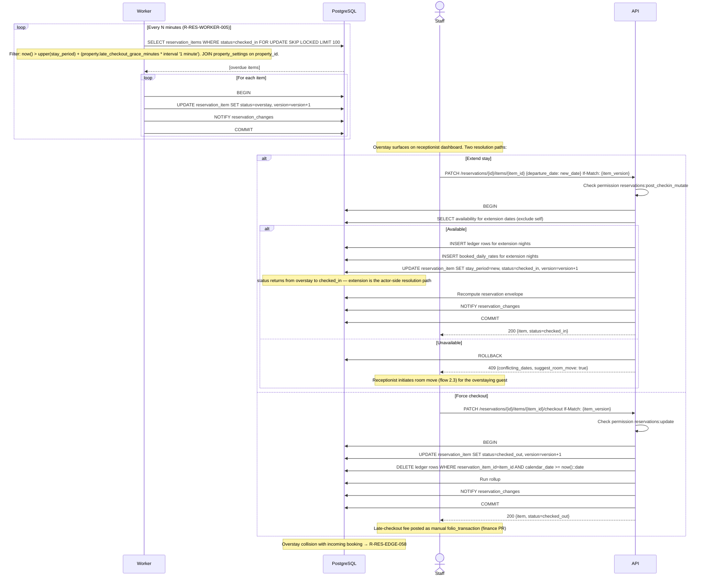
```mermaid
sequenceDiagram
    participant Worker
    participant DB as PostgreSQL
    actor Staff
    participant API

    loop Every N minutes (R-RES-WORKER-005)
        Worker->>DB: SELECT reservation_items WHERE status=checked_in FOR UPDATE SKIP LOCKED LIMIT 100
        Note over Worker: Filter: now() > upper(stay_period) + (property.late_checkout_grace_minutes * interval '1 minute'). JOIN property_settings on property_id.
        DB-->>Worker: [overdue items]
        loop For each item
            Worker->>DB: BEGIN
            Worker->>DB: UPDATE reservation_item SET status=overstay, version=version+1
            Worker->>DB: NOTIFY reservation_changes
            Worker->>DB: COMMIT
        end
    end

    Note over Staff: Overstay surfaces on receptionist dashboard. Two resolution paths:

    alt Extend stay
        Staff->>API: PATCH /reservations/{id}/items/{item_id} {departure_date: new_date} If-Match: {item_version}
        API->>API: Check permission reservations:post_checkin_mutate
        API->>DB: BEGIN
        API->>DB: SELECT availability for extension dates (exclude self)
        alt Available
            API->>DB: INSERT ledger rows for extension nights
            API->>DB: INSERT booked_daily_rates for extension nights
            API->>DB: UPDATE reservation_item SET stay_period=new, status=checked_in, version=version+1
            Note over DB: status returns from overstay to checked_in — extension is the actor-side resolution path
            API->>DB: Recompute reservation envelope
            API->>DB: NOTIFY reservation_changes
            API->>DB: COMMIT
            API-->>Staff: 200 {item, status=checked_in}
        else Unavailable
            API->>DB: ROLLBACK
            API-->>Staff: 409 {conflicting_dates, suggest_room_move: true}
            Note over Staff: Receptionist initiates room move (flow 2.3) for the overstaying guest
        end
    else Force checkout
        Staff->>API: PATCH /reservations/{id}/items/{item_id}/checkout If-Match: {item_version}
        API->>API: Check permission reservations:update
        API->>DB: BEGIN
        API->>DB: UPDATE reservation_item SET status=checked_out, version=version+1
        API->>DB: DELETE ledger rows WHERE reservation_item_id=item_id AND calendar_date >= now()::date
        API->>DB: Run rollup
        API->>DB: NOTIFY reservation_changes
        API->>DB: COMMIT
        API-->>Staff: 200 {item, status=checked_out}
        Note over Staff: Late-checkout fee posted as manual folio_transaction (finance PR)
    end

    Note over DB: Overstay collision with incoming booking → R-RES-EDGE-058
```

---

## 4. Terminal Flows

### 4.1 Cancellation with fee

Staff cancels reservation. Cancellation fee obligation posted to Folio A.
Reservation lands in `pending_cancellation` — not fully terminal until fee is
collected via payment processor (finance PR). Room is released immediately.

```mermaid
sequenceDiagram
    actor Staff
    participant API
    participant DB as PostgreSQL
    participant Worker
    participant Ext as SMTP

    Staff->>API: POST /reservations/{id}/cancel {reason_code, fee_pence=5000, waive_fee=false, fee_override_reason?, refund_action=refund_deposit} If-Match: {version}
    API->>API: Check permission reservations:cancel
    API->>DB: SELECT reservation + items — validate status not terminal (409 if checked_out/archived/cancelled/pending_cancellation — R-RES-EDGE-040) AND no item is checked_in (409 R-RES-VALID-013)
    Note over API,Staff: 409 body for R-RES-VALID-013: {code: "RESERVATION_HAS_CHECKED_IN_ITEMS", checked_in_item_ids: [uuid, ...], remediation: "Check-out or shorten the listed items, then retry cancel."}
    Note over Staff: To shorten rather than cancel, use §3.4 Early check-out (stay period shortened) — releases future nights without full cancellation
    API->>DB: BEGIN
    API->>DB: UPDATE reservation SET status=pending_cancellation, version=version+1
    API->>DB: UPDATE reservation_items SET status=cancelled (all non-terminal)
    API->>DB: DELETE ledger rows WHERE reservation_id=id AND calendar_date >= today
    API->>DB: INSERT folio_transaction (folio_a, description=cancellation_fee, amount=5000, status=pending)
    API->>DB: INSERT outbox_events (type=cancellation_email)
    API->>DB: INSERT outbox_events (type=audit_log)
    API->>DB: NOTIFY reservation_changes
    API->>DB: COMMIT
    API-->>Staff: 200 {reservation, status=pending_cancellation}

    Worker->>Ext: send cancellation email
    Worker->>DB: UPDATE outbox_events completed

    Note over DB: folio_transaction status=pending means OBLIGATION RECORDED — not collected. Finance PR implements collection: captured auth → net refund minus fee, or new charge if no deposit held. Reservation transitions to cancelled only once fee settled.
    Note over DB: refund_action=refund_deposit handled by payment provider integration (finance PR)
    Note over Staff: Frontend shows "Pending settlement" banner — not "Cancelled" — until finance PR wires collection
```

---

### 4.2 Cancellation with waived fee

Manager waives the cancellation fee. Requires `reservations:waive_fee`
permission. Waive amount is gated by `waive_fee_limit_pence` on the role
(deferred to auth PR — enforced server-side once auth PR lands).

```mermaid
sequenceDiagram
    actor Manager
    participant API
    participant DB as PostgreSQL

    Manager->>API: POST /reservations/{id}/cancel {reason_code=goodwill, fee_pence=5000, waive_fee=true} If-Match: {version}
    API->>API: Check permission reservations:waive_fee
    Note over API: Auth PR will enforce: fee_pence <= role.waive_fee_limit_pence. Unlimited = NULL. 403 if fee exceeds limit.
    alt No permission
        API-->>Manager: 403 Forbidden
    else Permitted
        API->>DB: BEGIN
        API->>DB: UPDATE reservation SET status=pending_cancellation, version=version+1
        API->>DB: UPDATE reservation_items SET status=cancelled
        API->>DB: DELETE ledger rows
        Note over DB: No folio_transaction — fee waived. Reservation may transition directly to cancelled (no settlement needed). Finance PR confirms flow.
        API->>DB: INSERT outbox_events (type=cancellation_email)
        API->>DB: NOTIFY reservation_changes
        API->>DB: COMMIT
        API-->>Manager: 200 {reservation, status=pending_cancellation}
    end
```

---

### 4.3 No-show — manual

Staff marks a guest as no-show after check-in time passes. Treated as
cancellation for payment purposes — any outstanding fee obligation must be
settled before reservation reaches terminal state (finance PR).

```mermaid
sequenceDiagram
    actor Staff
    participant API
    participant DB as PostgreSQL

    Staff->>API: PATCH /reservations/{id}/items/{item_id}/no-show If-Match: {item_version}
    API->>API: Check permission reservations:mark_no_show
    API->>DB: Validate lower(stay_period) <= NOW() (can only mark after check-in time)
    API->>DB: BEGIN
    API->>DB: UPDATE reservation_item SET status=no_show, version=version+1
    API->>DB: DELETE future ledger rows for item (dates after today)
    API->>DB: Run rollup — if all items terminal → update reservation status
    API->>DB: NOTIFY reservation_changes
    API->>DB: COMMIT
    API-->>Staff: 200 {item, status=no_show}

    Note over Staff: Any no-show fee posted as manual folio_transaction. Settlement via processor required before terminal cancellation (finance PR).
```

---

### 4.4 No-show — dashboard reminder

> **Automated sweep deferred.** Auto-marking of no-shows is not in scope for the
> current milestone. Staff are reminded via the receptionist dashboard instead;
> they act manually via §4.3.

Worker surfaces overdue check-ins on the receptionist dashboard. No automatic
status change.

```mermaid
sequenceDiagram
    participant Worker
    participant DB as PostgreSQL
    actor Staff
    participant API

    loop Every N minutes
        Worker->>DB: SELECT reservation_items WHERE status=booked AND lower(stay_period) + no_show_grace_minutes < NOW()
        DB-->>Worker: [overdue items]
        Worker->>DB: NOTIFY staff_alerts {type=no_show_overdue, item_ids: [...]}
    end

    Note over Staff: SSE listener forwards NOTIFY payload — receptionist dashboard highlights overdue check-ins without a page reload. Staff investigates and acts via §4.3 No-show — manual.
```

---

### 4.5 Reactivation — availability pass

Cancelled reservation reactivated. Dates still available.

```mermaid
sequenceDiagram
    actor Staff
    participant API
    participant DB as PostgreSQL

    Staff->>API: POST /reservations/{id}/reactivate If-Match: {version}
    API->>API: Check permission reservations:reactivate
    API->>DB: SELECT reservation — validate status=cancelled
    API->>DB: BEGIN
    API->>DB: SELECT availability for original dates (full re-check)
    alt Dates available
        API->>DB: UPDATE reservation SET status=confirmed, deleted_at=NULL, version=version+1
        API->>DB: UPDATE reservation_items SET status=booked (all cancelled items)
        API->>DB: INSERT ledger rows (re-pin room, one per date)
        API->>DB: NOTIFY reservation_changes
        API->>DB: COMMIT
        API-->>Staff: 200 {reservation, status=confirmed}
    else Dates unavailable
        API->>DB: ROLLBACK
        API-->>Staff: 409 Conflict {conflicting_dates}
    end

    Note over API: lower(stay_period) < today check fires before availability re-check (R-RES-EDGE-041). Returns 409 unless reservations:retroactive_create permission held.
```

---

### 4.6 Item-level cancel (multi-room)

One item in a multi-room reservation cancelled independently. Reservation rollup
unchanged unless all items reach a terminal state. See §4.2 for waived-fee path.

```mermaid
sequenceDiagram
    actor Staff
    participant API
    participant DB as PostgreSQL

    Note over Staff: 2-room reservation. Cancel item A only (Guest B staying).

    Staff->>API: POST /reservations/{id}/items/{item_id}/cancel {reason_code, fee_pence} If-Match: {item_version}
    API->>API: Check permission reservations:cancel
    API->>DB: SELECT reservation_item — validate status not terminal
    API->>DB: BEGIN
    API->>DB: UPDATE reservation_item SET status=cancelled, deleted_at=NOW(), version=version+1
    API->>DB: DELETE ledger rows WHERE reservation_item_id=item_id AND calendar_date >= today
    API->>DB: INSERT folio_transaction (cancellation_fee if fee_pence > 0, status=pending)
    API->>DB: Run rollup — item_b still booked → reservation stays confirmed
    API->>DB: NOTIFY reservation_changes
    API->>DB: COMMIT
    API-->>Staff: 200 {item, status=cancelled}

    Note over DB: Reservation status unchanged — rollup only promotes when ALL items reach terminal state
    Note over DB: folio_transaction status=pending = obligation recorded, not collected. Finance PR implements settlement.
```

---

### 4.7 Concurrent cancel + update race

Two staff members act on the same reservation simultaneously. The second
committer receives 412 Precondition Failed regardless of which operation wins.

```mermaid
sequenceDiagram
    actor Staff1
    actor Staff2
    participant API
    participant DB as PostgreSQL

    Note over DB: Reservation version=5

    Staff1->>API: POST /reservations/{id}/cancel If-Match: version=5
    Staff2->>API: PATCH /reservations/{id} {notes: "VIP"} If-Match: version=5

    Note over API: Both read version=5. Cancel commits first.

    API->>DB: Staff1: BEGIN → UPDATE SET status=pending_cancellation, version=6 → COMMIT
    API-->>Staff1: 200 {status=pending_cancellation}

    API->>DB: Staff2: BEGIN → SELECT version → returns 6 (mismatch)
    API->>DB: Staff2: ROLLBACK
    API-->>Staff2: 412 Precondition Failed {current_version: 6, provided_version: 5}

    Note over Staff2: Reload reservation, observe pending_cancellation status, reconcile accordingly
```

---

## 5. Background Workers

### 5.1 Hold expiry sweep (R-RES-INTEG-007)

Worker cancels stale holds. Per-source TTL from `operations.property_settings`.

```mermaid
sequenceDiagram
    participant Worker
    participant DB as PostgreSQL

    loop Every 30s
        Worker->>DB: SELECT expired holds by source TTL (FOR UPDATE SKIP LOCKED LIMIT 100)
        Note over Worker: JOIN property_settings for website/internal TTL. Filters holds past their TTL. Multi-tiered: internal holds with a guest_id have longer grace.
        DB-->>Worker: [expired holds]
        loop For each expired hold
            Worker->>DB: BEGIN
            Worker->>DB: UPDATE reservation SET status=cancelled, deleted_at=NOW()
            Worker->>DB: UPDATE reservation_items SET status=cancelled
            Worker->>DB: DELETE ledger rows WHERE reservation_id=id
            Worker->>DB: UPDATE payment_authorization SET released_at=NOW() (if website source)
            Worker->>DB: INSERT outbox_events (type=release_auth, payload={auth_id, provider}) (if website source)
            Worker->>DB: NOTIFY reservation_changes
            Worker->>DB: COMMIT
        end
    end

    Note over Worker: SKIP LOCKED allows multiple worker replicas without contention
    Note over Worker: No charge was made during hold — release_auth simply lifts the card hold. Outbox dispatcher calls provider release out-of-band, retried with exponential backoff. CRITICAL: dead-letter alert fires if release exhausts retries.
```

---

### 5.2 Archival sweep (R-RES-INTEG-008)

Worker archives old terminal reservations. Excludes from default list queries.

```mermaid
sequenceDiagram
    participant Worker
    participant DB as PostgreSQL

    loop Daily
        Worker->>DB: SELECT terminal reservations past archive threshold (FOR UPDATE SKIP LOCKED LIMIT 500)
        Note over Worker: JOIN property_settings for archive_after_days, status IN (checked_out, cancelled)
        DB-->>Worker: [archivable reservations]
        loop For each reservation
            Worker->>DB: BEGIN
            Worker->>DB: UPDATE reservation SET status=archived
            Worker->>DB: UPDATE reservation_items SET status=archived, deleted_at=NOW()
            Worker->>DB: UPDATE folios SET deleted_at=NOW() (zero-balance only)
            Worker->>DB: NOTIFY reservation_changes
            Worker->>DB: COMMIT
        end
    end

    Note over DB: Archived reservations excluded from list queries by default
    Note over DB: Opt-in via ?include_archived=true
```

---

## 6. Availability Check

### 6.1 Happy path

Rooms available for requested type and dates.

```mermaid
sequenceDiagram
    actor Client
    participant API
    participant Redis
    participant DB as PostgreSQL

    Client->>API: GET /reservations/availability?property_id=&room_type_id=&start_date=&end_date=
    API->>Redis: GET cache:availability:{property}:{type}:{from}:{to}
    alt Cache hit
        Redis-->>API: cached availability response
        API-->>Client: 200 {available: true, remaining_count: 3}
    else Cache miss
        API->>DB: SELECT count(rooms) WHERE room_type_id=... (total rooms in type)
        API->>DB: SELECT count(ledger rows) WHERE room.type=... AND calendar_date IN dates AND status IN (sold, on_hold, maintenance, decommissioned) GROUP BY calendar_date
        API->>DB: Check LOS restrictions from price grid (min_los, max_los, occupancy)
        API->>DB: Check housekeeping buffer (property_settings.housekeeping_buffer_minutes)
        DB-->>API: {total: 4, blocked_per_date: {2026-06-01: 1, 2026-06-02: 2}}
        API->>Redis: SET cache:availability:... (long TTL - safety net, invalidated via NOTIFY per ADR-010)
        API-->>Client: 200 {available: true, remaining_count: 2, per_date: {...}}
    end
```

---

### 6.2 Conflict path (R-RES-AVAIL-006)

No rooms available. Response includes which dates conflict.

```mermaid
sequenceDiagram
    actor Client
    participant API
    participant DB as PostgreSQL

    Client->>API: GET /reservations/availability?room_type_id=double&start_date=2026-06-01&end_date=2026-06-05
    API->>DB: SELECT aggregate availability per date
    DB-->>API: {2026-06-01: 0 remaining, 2026-06-02: 0 remaining, 2026-06-03: 1 remaining, ...}
    API-->>Client: 200 {available: false, conflicting_dates: [...], per_date: {...}}
    Note over Client: conflicting_dates lists fully blocked dates. Per-date gives total/blocked/remaining per night. Client can suggest alternative dates using per_date data.
```

---

### 6.3 Concurrent booking race (R-RES-EDGE-047)

Two clients see availability simultaneously. One wins; the other is caught by DB
constraint.

```mermaid
sequenceDiagram
    actor Guest1
    actor Guest2
    participant API
    participant DB as PostgreSQL

    Note over DB: 1 room remaining of type Double

    Guest1->>API: POST /reservations (last double, June 1-3)
    Guest2->>API: POST /reservations (last double, June 1-3)

    Note over API: Both pass aggregate availability check (read same snapshot)

    API->>DB: Guest1: BEGIN .. SELECT room FOR UPDATE SKIP LOCKED .. returns 101
    API->>DB: Guest2: BEGIN .. SELECT room FOR UPDATE SKIP LOCKED .. room 101 locked, returns NULL

    API->>DB: Guest2: ROLLBACK
    API-->>Guest2: 409 Conflict {conflicting_dates: ["2026-06-01", "2026-06-02"]}

    API->>DB: Guest1: INSERT ledger rows (room=101) + reservation + items
    API->>DB: Guest1: COMMIT
    API-->>Guest1: 201 {reservation}

    Note over DB: SKIP LOCKED ensures Guest2 doesn't wait for Guest1 to commit before failing.
    Note over DB: IF 2 rooms were available, Guest2 would have skipped 101 and picked 102 ✓
```

---

## 7. Inventory Conflicts

### 7.1 Maintenance block rejected by active reservation (R-RES-EDGE-008)

Staff attempts to place a maintenance block over dates already sold to a guest.
The DB ledger UNIQUE constraint prevents the overlap; the application layer
surfaces the conflict before insert.

```mermaid
sequenceDiagram
    actor Staff
    participant API
    participant DB as PostgreSQL

    Note over DB: Room 101 has reservation RES-000123 for June 1-5 (ledger status=sold).

    Staff->>API: POST /rooms/101/maintenance {block_period: June 3-7, type: deep_clean}
    API->>DB: SELECT ledger rows WHERE room_id=101 AND calendar_date IN (June 3-7) AND status=sold
    DB-->>API: {June 3, June 4, June 5 → sold to RES-000123}
    API-->>Staff: 409 Conflict {conflicting_reservations: ["RES-000123"], conflicting_dates: ["June 3","June 4","June 5"]}

    Note over Staff: Must reassign or cancel the conflicting reservation before placing maintenance block
```
