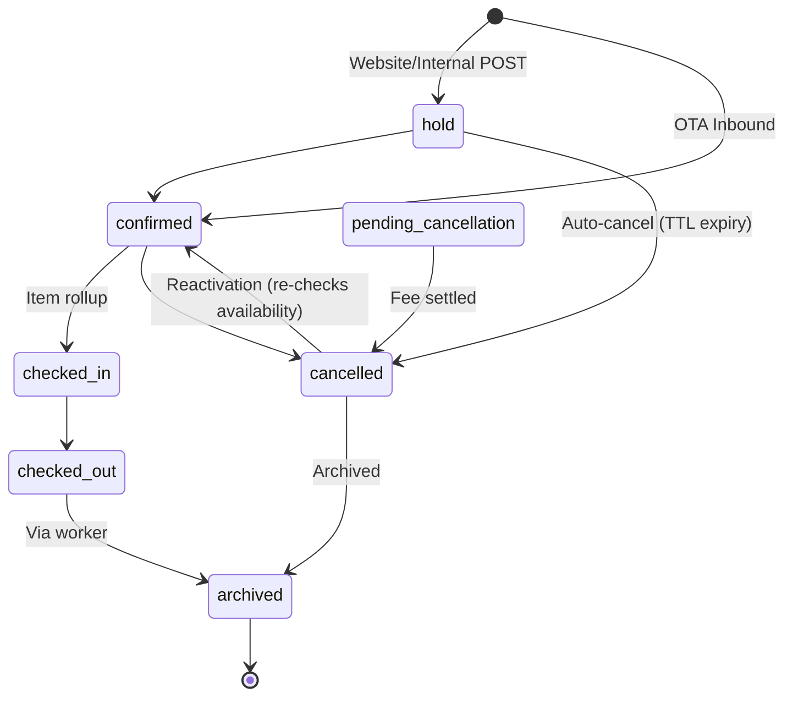
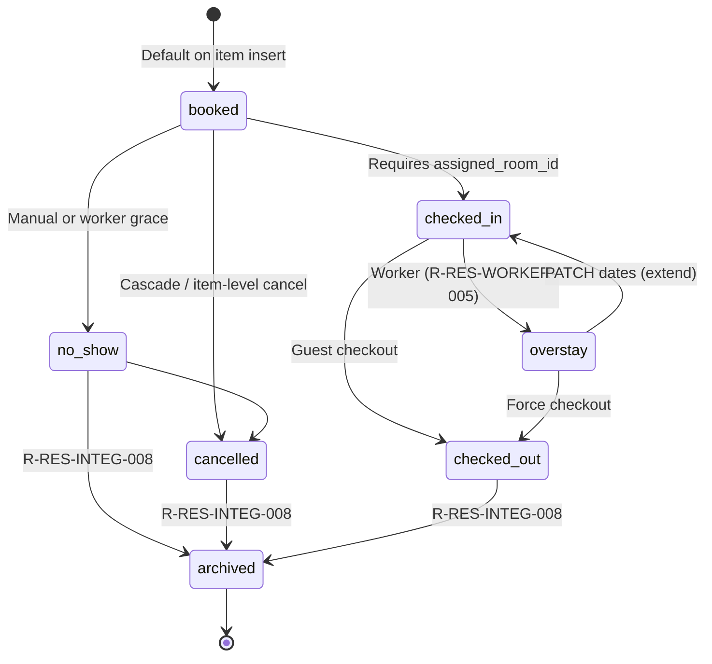
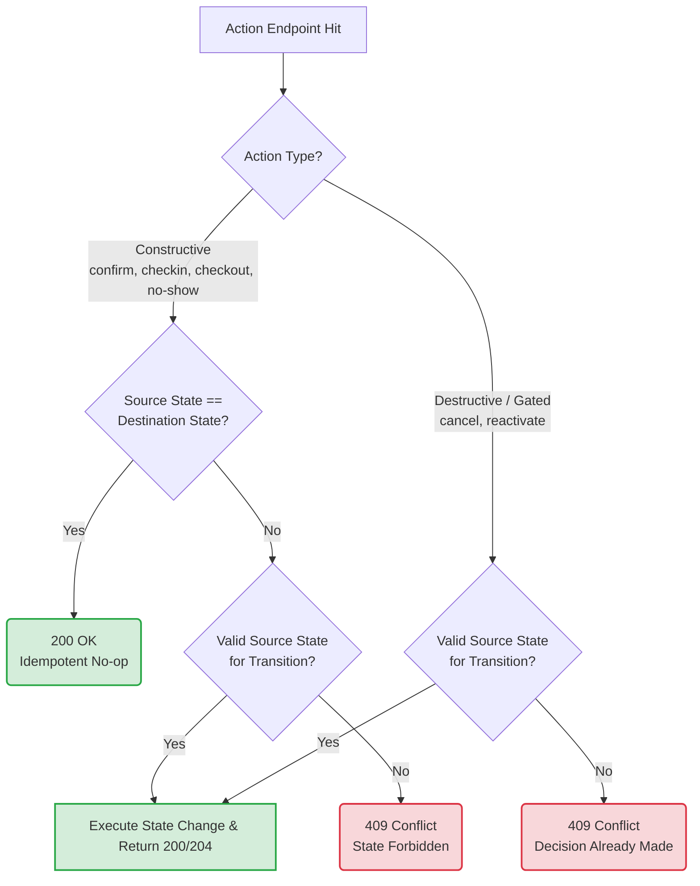

# Reservation API RTM

> Foundation requirements for the reservation domain. Edge cases live in section
> 8 - every edge case maps to a test. `>` prepending a requirement ID indicates
> that the requirement has been deferred, either because of the prune or
> currently out of scope.
>
> **NOTE** this approach to requirements has been changed to being done in
> Linear based on Job specs instead of low level technical requirements.

## 1. Core CRUD

- R-RES-CRUD-001: Create reservation with primary guest (or inline per
  R-RES-CRUD-015), ≥1 items
- R-RES-CRUD-002: GET single reservation by ID - includes items, guest details
- R-RES-CRUD-003: List reservations with filters (§9), cursor pagination
- R-RES-CRUD-004a: `PATCH /reservations/{id}` - updates reservation-level
  metadata only.
- R-RES-CRUD-004b: `PATCH /reservations/{id}/items/{item_id}` - updates
  item-level fields. Triggers availability re-check, ledger row move
  `>booked_daily_rates recompute in one tx.`
- `>`R-RES-CRUD-005: `POST /reservations/{id}/cancel` — from
  `confirmed`/`no_show`: status→`cancelled`, items→`cancelled`, future ledger
  rows deleted, fee posted to Folio A (unless waive_fee), NOTIFY, cancellation
  email. From `hold`: same transitions + ledger deletion but no folio tx — fee
  fields ignored. `reservations:waive_fee` required for waive_fee=true
- R-RES-CRUD-006: Reactivate cancelled reservation: status→`confirmed`, clear
  deleted_at, re-check availability, re-pin ledger. 409 if dates unavailable
- R-RES-CRUD-007: Reservation code `RES-XXXXXX`, sequential per property via
  `operations.reservation_sequences`, incremented with `SELECT … FOR UPDATE`. M1
- `>`R-RES-CRUD-008: Creation produces audit log entry via transactional outbox
- R-RES-CRUD-009: Creation produces ≥1 reservation_item +
  `>one booked_daily_rates row per item per night`, atomic with reservation
  insert. `walkin`/`internal` may pre-fill room; `website` defers — ledger
  auto-pins (R-RES-AVAIL-009)
- `>`R-RES-CRUD-010: Creation creates at least Folio A (stay charges). Folios
  B/C created lazily by staff
- R-RES-CRUD-011: Each item must have a room_inventory_ledger entry
- R-RES-CRUD-012: All entities isolated by `property_id` via RLS
  (`app.current_property_id`)
- R-RES-CRUD-013: Lifecycle: `hold` default for `website`/`internal`; `walkin`
  bypasses to `checked_in`; OTA lands in `confirmed`
- R-RES-CRUD-014: Walk-in requires room assigned on every item, creates in
  `checked_in`/`sold` today only. Stay bounds derived from property check-in/out
  times. Falls back to property default rate plan if rate omitted (no separate
  `walkin_rate_plan_id`). Per-night overrides via R-RES-CRUD-016
- R-RES-CRUD-015: POST accepts existing `primary_guest_id` OR inline guest
  payload created in same tx. Same per item. Email dedup: matching active guest
  reused
- `>`R-RES-CRUD-016: `PATCH .../booked-rates` - per-night rate override with
  audit log. Past nights immutable post-checkout. Permission:
  `reservations:rate_override`
- R-RES-CRUD-017: `POST /reservations/{id}/items` - add item to non-terminal
  reservation. Triggers availability check, ledger pin, booked_daily_rates
  insert, envelope recompute (ADR-020), version bump. 409 if terminal.
  Permission: `reservations:add_item`
- R-RES-CRUD-018: `POST /reservations/{id}/confirm` - hold→confirmed (staff
  path). Idempotent on confirmed. Requires guest attached. Permission:
  `reservations:confirm`

## 2. Availability & Conflict Prevention

- R-RES-AVAIL-001: Availability check required before create/update
- R-RES-AVAIL-002: Reads `inventory.room_inventory_ledger` statuses `sold`,
  `on_hold`, `maintenance`, `decommissioned`. Ledger is single source of truth
- R-RES-AVAIL-003: Per-room overlap: DB EXCLUDE on reservation_items + ledger
  UNIQUE(room_id, calendar_date). Per-type overlap: app-level available count.
  Auto-pin at hold converts type-race → room-race → DB resolves
- R-RES-AVAIL-004: Concurrent attempts for same room/date serialised per ADR-013
- R-RES-AVAIL-005: ~~housekeeping_buffer_minutes~~ superseded by ADR-018.
  Same-day turnover from gap between default_checkout_time and
  default_checkin_time. Buffer advisory only
- R-RES-AVAIL-006: Rejected overlap reports specific conflicting dates
- R-RES-AVAIL-007: Availability response includes remaining count per room type
  per date
- R-RES-AVAIL-008: Check enforces LOS, occupancy, and rate-grid restrictions
  (consolidated with R-RES-RATE-005)
- R-RES-AVAIL-009: On hold creation — auto-select lowest available room of
  requested type, write ledger rows. `assigned_room_id` on item stays NULL until
  staff confirms; ledger may be moved to same-type room without changing it
- R-RES-AVAIL-010: Hold expiry via background worker (§12). Per-source TTL, per
  property
- R-RES-AVAIL-011: Cancel or early checkout — delete future-dated ledger rows
- R-RES-AVAIL-012: Maintenance blocks write `maintenance` ledger rows per
  calendar_date. UNIQUE(room_id, calendar_date) prevents overlap at DB level

## 3. Guest & Room Assignment

- R-RES-GROOM-001: Primary guest required at creation — must exist in property
  OR be inline (R-RES-CRUD-015)
- R-RES-GROOM-002: Additional guests attachable per item
- R-RES-GROOM-003: Item assigned_room_id optional at create, required before
  check-in. Ledger auto-pins at hold regardless
- R-RES-GROOM-004: Room assignment validates no overlap with another reservation
- R-RES-GROOM-005: Room assignable up to and including day of check-in
- R-RES-GROOM-006: Guest name/contact validated against guest table constraints
- R-RES-GROOM-007: Pre-checkin room change: standard conflict check (ledger
  UNIQUE + EXCLUDE GIST), no extra permission. Post-checkin: additionally
  requires `reservations:post_checkin_mutate`. Ledger rows UPDATE in place
  (`UPDATE SET room_id`), not deleted and re-inserted

## 4. Rate & Pricing

- R-RES-RATE-001: Rate resolved per night from appropriate rate level
- R-RES-RATE-002: Base rate = base rate per night per room type per item
- R-RES-RATE-003: Derived rate plans apply percentage or fixed adjustment to
  parent rate
- R-RES-RATE-004: Tax rules applied by property to reservation total
- R-RES-RATE-005: LOS restrictions (min_los, max_los) enforced — see
  R-RES-AVAIL-008
- R-RES-RATE-006: Multi-room: per-item pricing aggregated to reservation total

## 5. Validation & Constraints

- R-RES-VALID-001: stay_period: lower < upper, both bounds required. DB CHECK
  enforces. Items in same reservation may differ
- R-RES-VALID-002: lower(stay_period) not before today (UTC, tz-aware). Except:
  `reservations:retroactive_create` or is_walkin=true
- R-RES-VALID-003: Stay period ≤ max stay length (property setting)
- R-RES-VALID-004: All mutations require `Idempotency-Key` header (ADR-007)
- R-RES-VALID-005: Idempotency-Key with different body → 409
- R-RES-VALID-006: Status transitions follow state machine (§7)
- R-RES-VALID-007: Cancelled reservation not mutable except via reactivation —
  409 otherwise
- R-RES-VALID-008: Notes max 2500 chars (DB constraint)
- R-RES-VALID-009: Reservation code unique per property (DB enforced)
- R-RES-VALID-010: Occupancy must satisfy room type min/max
- R-RES-VALID-011: Walk-in must be created today, room assigned immediately
  (R-RES-CRUD-014)
- R-RES-VALID-012: Mutating endpoints require `If-Match: <version>`. Mismatch
  → 412. Mutation bumps version. Items have own version column (M2)
- R-RES-VALID-013: Cancel rejected 409 if any item is `checked_in`. Must
  checkout/shorten first. Item-level cancel also rejects checked_in items (§7.2)
- R-RES-VALID-014: Cancel of `hold` → no folio tx. fee_pence/waive_fee ignored.
  Worker-driven expiry likewise posts no fee
- R-RES-VALID-015: Body accepts arrival/departure as DATE; server composes
  TSTZRANGE with property check-in/out times (ADR-018). Explicit timestamps
  require `reservations:override_restrictions`

## 6. Integration Points

- `> caching strategy changed, no need to cache reservations` R-RES-INTEG-001:
  Cache reservation queries via platform/cache with TTL + pattern invalidation
- `>` R-RES-INTEG-002: Invalidate cache on create, update, cancel, room
  assignment
- `>` R-RES-INTEG-003: Emit `NOTIFY reservation_changes` on mutation for
  reactive invalidation and real-time updates
- `>` R-RES-INTEG-004: Enqueue confirmation/cancellation emails via
  transactional outbox

- `>`R-RES-INTEG-005: Rate calculation uses GetOrSet on price grid cache
- R-RES-INTEG-006: State changes traceable via OpenTelemetry spans
- R-RES-INTEG-007: Hold-expiry worker: cancels holds past source TTL
  (per-source, per-property, M4). Deletes ledger rows, marks checkout_session
  expired, NOTIFY. Multi-tier TTL for guest-attached vs anonymous internal holds
  (ADR-016)
- R-RES-INTEG-008: Archival worker: terminal reservations older than
  `reservation_archive_after_days` (M4, default 365) → `archived`, soft-archive
  items + folios. Excluded from default list; opt-in via
  `?include_archived=true`

## 6.5 Authorization

Permissions resolved against `auth.users` + roles. Cross-property staff scoped
via `app.current_property_id`. See companion
`/docs/requirements/authorization.md`.

| Action                                                         | Permission                                 |
| -------------------------------------------------------------- | ------------------------------------------ |
| Create reservation (any source)                                | `reservations:create`                      |
| PATCH metadata                                                 | `reservations:update`                      |
| PATCH item (dates, type, rate)                                 | `reservations:update_item`                 |
| Cancel                                                         | `reservations:cancel`                      |
| Cancel with `waive_fee=true`                                   | `reservations:waive_fee`                   |
| Reactivate                                                     | `reservations:reactivate`                  |
| Retroactive create (past `lower(stay_period)`)                 | `reservations:retroactive_create`          |
| Override LOS / occupancy restrictions                          | `reservations:override_restrictions`       |
| Mutate post-`checked_in` reservation                           | `reservations:post_checkin_mutate`         |
| Assign / reassign room                                         | `reservations:assign_room`                 |
| Mark `no_show` manually                                        | `reservations:mark_no_show`                |
| Manual archive / unarchive                                     | `reservations:archive`                     |
| Confirm a `hold` reservation (explicit)                        | `reservations:confirm`                     |
| Add a new item to an existing reservation                      | `reservations:add_item`                    |
| `>`Per-night rate edit on `booked_daily_rates`                 | `reservations:rate_override`               |
| Cancel-fee override (when finance PR lands)                    | `reservations:fee_override`                |
| Override rate plan daily capacity                              | `reservations:override_rate_plan_capacity` |
| Change room type (upgrade / downgrade)                         | `reservations:change_room_type`            |
| `>`Approve rate adjustment or retain price on type/plan change | `reservations:adjust_rate`                 |
| Override Do Not Move flag (with reason)                        | `reservations:override_dnm`                |

## 7. State Machines

Reservation and item have separate state machines. Item transitions drive
reservation rollup (see ADR-015).

### 7.1 Reservation status (`operations.reservation_status`)

### 7.2 Reservation item status (`operations.reservation_item_status`)

### 7.3 Rollup rule (item → reservation)

- All items `cancelled` → reservation `cancelled`
- All items terminal AND ≥1 `checked_out` → reservation `checked_out`
- ≥1 item `checked_in` AND no items `booked` → reservation `checked_in`
- Otherwise reservation status unchanged

Captured in ADR-015.

### 7.4 Action endpoint idempotency

Action endpoints behave per the table below when the target is already in the
destination state, or when the source state forbids the transition. Constructive
actions are idempotent no-ops on already-applied state; destructive actions
reject because a fee / refund / state decision was already made. See
R-RES-EDGE-061.

> **Reading the table.** Each row is `(endpoint, source state)`. If the source
> is the destination state itself → "200 no-op" for constructive actions;
> otherwise → 409. For `reactivate`, the only valid source is `cancelled`, so
> every other source state lands in 409 — there is no "already-applied"
> semantics.

## 8. Edge Cases

> Each edge case must map to a test. Expected Behaviour references the
> requirement that resolves it. See `cmd/rtmcheck` for test traceability

| ID             | Edge Case                                                                | Expected Behaviour                                                                                              |
| -------------- | ------------------------------------------------------------------------ | --------------------------------------------------------------------------------------------------------------- |
| R-RES-EDGE-001 | Concurrent booking of last available room of a type                      | First commit wins via R-RES-AVAIL-003 (DB UNIQUE on ledger). Loser 409 with conflicting dates                   |
| R-RES-EDGE-002 | Date update on checked-in reservation                                    | Requires `reservations:post_checkin_mutate`. Extension only; shortening per R-RES-EDGE-035                      |
| R-RES-EDGE-003 | Reactivating when original dates now conflicted                          | R-RES-CRUD-006 re-checks. 409 with conflict dates                                                               |
| R-RES-EDGE-004 | Reservation spanning rate plan boundary                                  | Each night resolved against rate plan in force on that calendar date (R-RES-RATE-001)                           |
| R-RES-EDGE-005 | Cancelling one item in multi-room reservation                            | Item-level cancel via PATCH item; rollup unchanged unless all items terminal                                    |
| R-RES-EDGE-006 | Idempotency key retry with identical body                                | ADR-007: cached response returned                                                                               |
| R-RES-EDGE-007 | Booking against room in maintenance block                                | R-RES-AVAIL-012: ledger UNIQUE rejects. 409 with maintenance block dates                                        |
| R-RES-EDGE-008 | Maintenance required during active stay                                  | Maintenance block creation rejected if overlapping sold ledger rows. Staff must reassign first                  |
| R-RES-EDGE-009 | Guest has open folio balance at cancellation                             | Cancel proceeds; folio balance preserved. Refund per `refund_action` in R-RES-CRUD-005                          |
| R-RES-EDGE-010 | Rate plan deactivated mid-stay                                           | `rate_plan_id` ON DELETE SET NULL. Existing booked_daily_rates preserved (snapshot)                             |
| R-RES-EDGE-011 | Checked-in room exceeds max LOS                                          | Existing reservations grandfathered                                                                             |
| R-RES-EDGE-012 | OTA booking concurrent with manual booking                               | OTA inbound queued; same DB constraints apply. Loser dead-lettered after retries                                |
| R-RES-EDGE-013 | Stagnant lock preventing further booking                                 | R-RES-INTEG-007 sweeps stale holds                                                                              |
| R-RES-EDGE-014 | Availability check for dates with no configured rates                    | 200 `available: false` per affected dates, `reason: no_rate_configured`                                         |
| R-RES-EDGE-015 | Override min LOS for last-minute booking                                 | Requires `reservations:override_restrictions`. Override logged in audit                                         |
| R-RES-EDGE-016 | Zero-night stay booking                                                  | Rejected: stay_period CHECK requires `lower < upper`                                                            |
| R-RES-EDGE-017 | Adjacent date ranges (check-in & check-out same day)                     | TSTZRANGE upper bound exclusive; adjacent ranges don't overlap. Allowed unless buffer applies (R-RES-AVAIL-005) |
| R-RES-EDGE-018 | Availability check spanning DST boundary                                 | All times TIMESTAMPTZ (UTC). DST handled at presentation layer                                                  |
| R-RES-EDGE-019 | Availability check during leap year                                      | Postgres DATE arithmetic handles correctly                                                                      |
| R-RES-EDGE-020 | All rooms assigned, cancellation during availability check               | Eventually consistent; final commit re-checks via R-RES-AVAIL-001                                               |
| R-RES-EDGE-021 | Stay spans two seasonal rate periods                                     | Per-night resolution (R-RES-RATE-001) handles automatically                                                     |
| R-RES-EDGE-022 | Derived rate plan updated                                                | New rate applies to new bookings only. Existing booked_daily_rates snapshot preserved                           |
| R-RES-EDGE-023 | Complimentary reservation (£0 stay)                                      | Allowed. base_rate_pence=0 passes CHECK (>=0). Folio A still created                                            |
| R-RES-EDGE-024 | Tax rule changed after reservation confirmed                             | folio_transactions snapshot `tax_rate_snapshot`; existing tax preserved                                         |
| R-RES-EDGE-025 | Derived rate plan results in negative nightly rate                       | Clamped to 0 with warning. Override required for true comp                                                      |
| R-RES-EDGE-026 | Rate adjustment results in negative nightly rate                         | Same as EDGE-025                                                                                                |
| R-RES-EDGE-027 | No rate for a day in stay period                                         | Booking rejected with explicit missing-date list                                                                |
| R-RES-EDGE-028 | Multi-room reservation where rate plan varies per item                   | Per-item `rate_plan_id` allowed. Aggregated total per R-RES-RATE-006                                            |
| R-RES-EDGE-029 | Rate plan not consistent across stay                                     | Allowed via per-night `booked_daily_rates.rate_plan_id`                                                         |
| R-RES-EDGE-030 | Primary guest soft-deleted or redacted                                   | Read returns redacted guest payload. Mutations require new guest assignment                                     |
| R-RES-EDGE-031 | Simultaneous room assignment to different reservations                   | DB EXCLUDE constraint rejects loser                                                                             |
| R-RES-EDGE-032 | Guest added to item at max occupancy                                     | Rejected per R-RES-VALID-010                                                                                    |
| R-RES-EDGE-033 | Room type deactivated after confirmation                                 | Existing reservation preserved. Deactivation prevents new bookings only                                         |
| R-RES-EDGE-034 | Stay extended where new checkout conflicts with concurrent reservation   | R-RES-AVAIL-003 + R-RES-VALID-012 (If-Match) — loser 409 or 412                                                 |
| R-RES-EDGE-035 | Stay shortened on checked-in reservation                                 | Allowed with `reservations:post_checkin_mutate`. Future ledger rows deleted                                     |
| R-RES-EDGE-036 | Room type changed before check-in                                        | PATCH item: re-check availability, move ledger row, recompute booked_daily_rates                                |
| R-RES-EDGE-037 | Room type changed during stay                                            | Same as EDGE-036 + `reservations:post_checkin_mutate`. Ledger split: past dates retained                        |
| R-RES-EDGE-038 | Rate changed during stay                                                 | PATCH item rate_plan_id; future booked_daily_rates recomputed, past preserved                                   |
| R-RES-EDGE-039 | Rate changed before check-in                                             | PATCH item rate_plan_id; full recompute                                                                         |
| R-RES-EDGE-040 | Cancel attempted on checked-out reservation                              | 409 — terminal state                                                                                            |
| R-RES-EDGE-041 | Reactivation attempted on past reservation                               | 409 if `lower(stay_period) < today` (unless `reservations:retroactive_create`)                                  |
| R-RES-EDGE-042 | Reservation cancelled and reactivated multiple times                     | Allowed; each cycle audited                                                                                     |
| R-RES-EDGE-043 | Server crash after lock acquired but before reservation committed        | R-RES-INTEG-007 recovers stale holds                                                                            |
| R-RES-EDGE-044 | Same Idempotency-Key arrives in parallel                                 | ADR-007: atomic Redis SET NX; second request waits or 409s                                                      |
| R-RES-EDGE-045 | Concurrent update and cancel for same reservation                        | R-RES-VALID-012 (If-Match) — second mutation 412                                                                |
| R-RES-EDGE-046 | Server crash during reservation creation                                 | Tx rolled back. Idempotency-Key replay completes the create                                                     |
| R-RES-EDGE-047 | Room available at check time, unavailable at booking time                | Auto-pin at hold (R-RES-AVAIL-009) resolves to per-room DB conflict                                             |
| R-RES-EDGE-048 | Check-in attempted with no room assigned                                 | Rejected per R-RES-GROOM-003 + state transition guard                                                           |
| R-RES-EDGE-049 | Check-in attempted before check-in date                                  | Rejected unless `reservations:override_restrictions` (early arrival)                                            |
| R-RES-EDGE-050 | `no_show` marked before check-in date                                    | Rejected — only valid after `lower(stay_period)` + grace                                                        |
| R-RES-EDGE-051 | PATCH dates on checked-in reservation                                    | Requires `reservations:post_checkin_mutate`. Past nights immutable                                              |
| R-RES-EDGE-052 | Batch status update on mix of items at various states                    | Per-item validation. 207 Multi-Status with per-item result                                                      |
| R-RES-EDGE-053 | Outbox worker fails to deliver confirmation email                        | Retry with exponential backoff; dead-letter after N attempts                                                    |
| R-RES-EDGE-054 | Redis returns stale availability during invalidation race                | Cache TTL fallback; final commit re-checks at DB                                                                |
| R-RES-EDGE-055 | OpenTelemetry span fails to initialise                                   | Warn logged; reservation proceeds                                                                               |
| R-RES-EDGE-056 | Reservation created but NOTIFY fails                                     | Cache TTL fallback; consumers eventually consistent                                                             |
| R-RES-EDGE-057 | LOS requirements updated with existing reservations over new requirement | Existing reservations grandfathered; new bookings enforce updated LOS                                           |
| R-RES-EDGE-058 | Overstay collides with incoming reservation                              | Item flagged `overstay`; receptionist negotiates room move (2.3) or extends if free                             |
| R-RES-EDGE-059 | Cancel attempted on partially-checked-in reservation                     | 409 with list of `checked_in` item IDs per R-RES-VALID-013. Caller must checkout/shorten first                  |
| R-RES-EDGE-061 | Action endpoint called with target already in destination state          | Constructive (confirm/checkin/checkout) → 200 no-op; destructive (cancel/reactivate) → 409. Per §7.4            |

## 9. API Endpoints

| Method   | Path                                                                                                                                                                             | Purpose                                            |
| -------- | -------------------------------------------------------------------------------------------------------------------------------------------------------------------------------- | -------------------------------------------------- |
| `POST`   | `/api/v1/reservations`                                                                                                                                                           | Create reservation (source-aware)                  |
| `GET`    | `/api/v1/reservations/{id}`                                                                                                                                                      | Get reservation by ID                              |
| `GET`    | `/api/v1/reservations?property_id=&date_from=&date_to=&status[]=&source[]=&group_id=&travel_agent_id=&assigned_room_id=&room_type_id=&q=&sort=&cursor=&limit=&include_archived=` | List reservations (cursor pagination, see ADR-014) |
| `PATCH`  | `/api/v1/reservations/{id}`                                                                                                                                                      | Update reservation metadata (R-RES-CRUD-004a)      |
| `PATCH`  | `/api/v1/reservations/{id}/items/{item_id}`                                                                                                                                      | Update reservation item (R-RES-CRUD-004b)          |
| `POST`   | `/api/v1/reservations/{id}/cancel`                                                                                                                                               | Cancel reservation (R-RES-CRUD-005)                |
| `POST`   | `/api/v1/reservations/{id}/reactivate`                                                                                                                                           | Reactivate cancelled reservation                   |
| `GET`    | `/api/v1/reservations/availability?property_id=&start_date=&end_date=&room_type_id=`                                                                                             | Check availability                                 |
| `PATCH`  | `/api/v1/reservations/{id}/items/{item_id}/checkin`                                                                                                                              | Check in reservation item                          |
| `PATCH`  | `/api/v1/reservations/{id}/items/{item_id}/checkout`                                                                                                                             | Check out reservation item                         |
| `PATCH`  | `/api/v1/reservations/{id}/items/{item_id}/assign-room`                                                                                                                          | Assign room to reservation item                    |
| `PATCH`  | `/api/v1/reservations/{id}/checkin`                                                                                                                                              | Check in whole reservation (all items)             |
| `PATCH`  | `/api/v1/reservations/{id}/checkout`                                                                                                                                             | Check out whole reservation (all items)            |
| `POST`   | `/api/v1/reservation-groups`                                                                                                                                                     | Create group                                       |
| `PATCH`  | `/api/v1/reservation-groups/{id}`                                                                                                                                                | Update group metadata                              |
| `POST`   | `/api/v1/reservation-groups/{id}/reservations/{rid}`                                                                                                                             | Attach reservation to group                        |
| `DELETE` | `/api/v1/reservation-groups/{id}/reservations/{rid}`                                                                                                                             | Detach reservation from group                      |
| `POST`   | `/api/v1/reservation-groups/{id}/cancel`                                                                                                                                         | Cascade cancel group                               |
| `>POST`  | `/api/v1/channels/{channel_id}/webhook`                                                                                                                                          | OTA inbound webhook (section 10)                   |
| `POST`   | `/api/v1/reservations/{id}/confirm`                                                                                                                                              | Confirm a `hold` reservation (staff path)          |
| `POST`   | `/api/v1/reservations/{id}/items`                                                                                                                                                | Add a new item to a non-terminal reservation       |
| `>PATCH` | `/api/v1/reservations/{id}/items/{item_id}/booked-rates`                                                                                                                         | Per-night rate override                            |
| `>GET`   | `/api/v1/reservations/{id}/items/{item_id}/booked-rates`                                                                                                                         | Read per-night rate rows for an item               |
| `>GET`   | `/api/v1/reservations/{id}/folios/{folio_id}`                                                                                                                                    | Folio read incl. paginated transactions            |
| `>GET`   | `/api/v1/reservations/{id}/cancellation-quote`                                                                                                                                   | Cancel-fee preview (stub until finance PR)         |

> **List filter rewrite (Q17):** `?date_from=&date_to=` will be replaced with
> `arriving_from`, `arriving_to`, `departing_from`, `departing_to`,
> `in_house_on`, `stay_overlaps_from`, `stay_overlaps_to`. Default sort:
> `arrival_date` asc, `id` tiebreak. See `docs/TODO.md`.

## 10. Background Workers

| ID               | Worker            | Trigger                               | Action                                                                                                                                          |
| ---------------- | ----------------- | ------------------------------------- | ----------------------------------------------------------------------------------------------------------------------------------------------- |
| R-RES-WORKER-001 | Hold expiry       | Every 30s                             | See R-RES-INTEG-007                                                                                                                             |
| R-RES-WORKER-002 | Archival          | Daily                                 | See R-RES-INTEG-008                                                                                                                             |
| R-RES-WORKER-003 | No-show sweep     | Daily after configured no-show grace  | Mark un-checked-in items past `lower(stay_period) + no_show_grace_minutes` as `no_show`                                                         |
| R-RES-WORKER-004 | Outbox dispatcher | Continuous (existing platform/worker) | Emails per R-RES-INTEG-004                                                                                                                      |
| R-RES-WORKER-005 | Overstay sweep    | Every N minutes                       | Select `checked_in` items where `now() > upper(stay_period) + late_checkout_grace_minutes`; transition to `overstay`. Notify dashboard. ADR-018 |

## 11. Schema Migrations Required

> This method is too constrictive, not very agile. In future, we will be just
> leaving it to the developer to create an implementation plan for the
> migrations.

| #   | Migration                                                                                                                                                                                                                                                                                            |
| --- | ---------------------------------------------------------------------------------------------------------------------------------------------------------------------------------------------------------------------------------------------------------------------------------------------------- |
| M1  | `operations.reservation_sequences (property_id PK, next_value INT)` + trigger to populate code; drop SERIAL on `operations.reservations.sequential` and `operations.reservation_groups.sequential`                                                                                                   |
| M2  | `version INTEGER NOT NULL DEFAULT 1` on `operations.reservation_items`                                                                                                                                                                                                                               |
| M3  | Add `'maintenance'` to `inventory.inventory_status` enum + nullable `maintenance_block_id UUID` FK on ledger; relax CHECK to allow maintenance rows                                                                                                                                                  |
| M4  | Property settings: `website_hold_ttl_seconds`, `internal_hold_ttl_seconds`, `reservation_archive_after_days`, `housekeeping_buffer_minutes`, `no_show_grace_minutes`                                                                                                                                 |
| M5  | `operations.ota_inbound_messages (channel_id, channel_message_id, processed_at, response_jsonb, action)`. Prerequisite: `CREATE TYPE operations.ota_action AS ENUM ('create','modify','cancel')`. Schema details for OTA cancel-target lookup deferred to ota-channels.md                            |
| M6  | `operations.reservations.stay_period_envelope TSTZRANGE NOT NULL`. GIST index on `(property_id, stay_period_envelope)`. (ADR-020)                                                                                                                                                                    |
| M7  | Extend `operations.reservation_item_status` with `'overstay'`. Add transitions per §7.2                                                                                                                                                                                                              |
| M8  | Rename `operations.checkout_sessions` → `operations.payment_authorizations`. Add `provider`, `auth_id`, `expires_at`, `captured_at`, `voided_at`. (ADR-019 — deferred to finance PR)                                                                                                                 |
| M9! | **DESTRUCTIVE — single transaction.** Rewrites every `operations.reservations.stay_period` row to property-time bounds (`default_checkin_time`, `default_checkout_time`). Irreversible without migration log. Bang suffix marks atomicity requirement. (ADR-018)                                     |
| M10 | Fix `pricing.booked_daily_rates` unique constraint: drop `UNIQUE (reservation_item_id, calendar_date)`, replace with partial `UNIQUE (reservation_item_id, calendar_date) WHERE (deleted_at IS NULL)`. Required for soft-delete + re-insert pattern (§2.6, §3.4, §2.1). Per convention in CLAUDE.md. |
| M12 | Add `daily_room_capacity INT CHECK (daily_room_capacity > 0)` (nullable = unlimited) to `pricing.daily_price_grid`. Rate plan capacity per calendar date. Override requires `reservations:override_rate_plan_capacity`.                                                                              |
| M11 | Add `'pending_cancellation'` to `operations.reservation_status` enum. Sits between cancel-initiation and terminal `cancelled`. Finance PR owns the `pending_cancellation → cancelled` transition (fee collection gate).                                                                              |

## 12. Related ADRs

- ADR-007: Idempotency-Key enforcement
- ADR-008: Redis caching layer
- ADR-010: Reactive cache invalidation
- ADR-012: Transactional outbox worker
- ADR-013: Locking + availability strategy
- ADR-014: Cursor pagination convention
- ADR-015: State machine rollup rule
- ADR-016: Guest-aware hold TTLs
- ADR-017: Real-time frontend updates via SSE
- ADR-018: `stay_period` time semantics
- ADR-019: Payment authorization model (deferred impl)
- ADR-020: `stay_period_envelope` materialised column
- ADR-022: Response depth control via `?include=` query parameter
