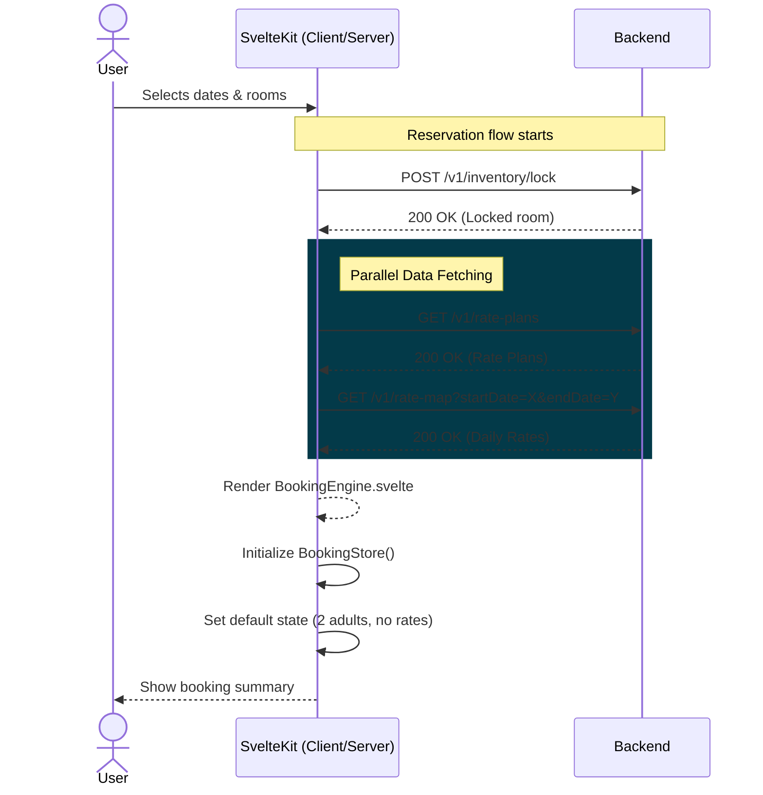
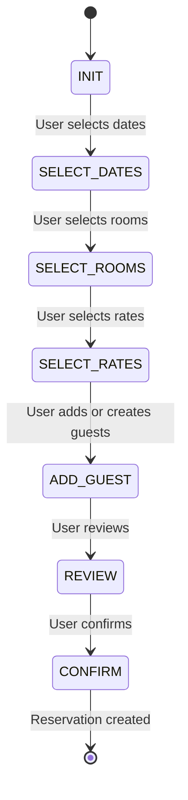
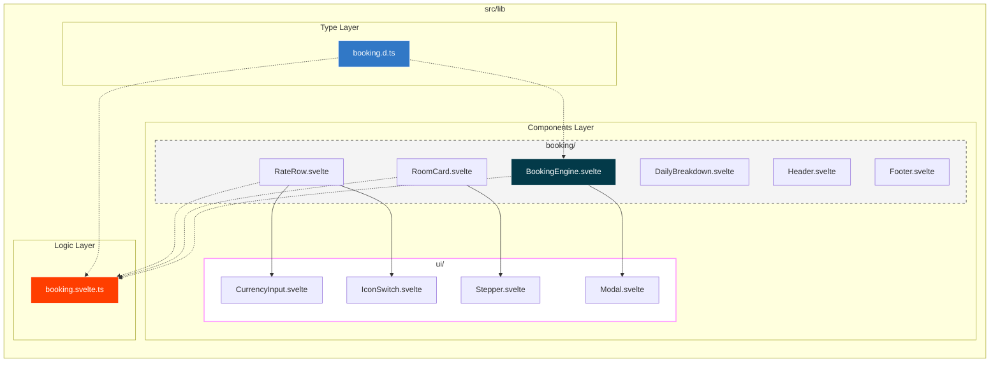
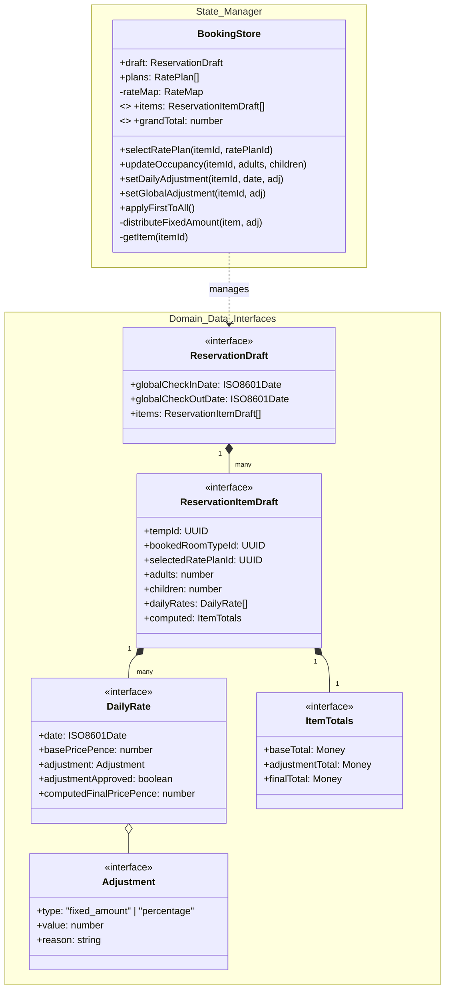
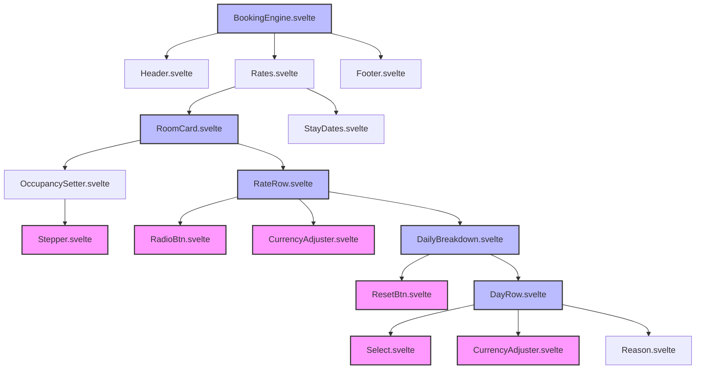

# Booking Engine Implementation Plan

## 1. Data Flow Architecture

We separate **Reference Data** (immutable from server) from **Booking State** (mutable by user).

1. **Server Load (`+page.server.ts`):** Fetches `RatePlans` and `DailyRates`.
2. **Store Initialization:** Hydrates the `bookingStore` with default values (0 adults, no rate selected).
3. **User Interaction:** Updates `BookingState` (adjustments, selection).
4. **Derived Calculation:** Combines `Reference Data` + `Booking State` to show final prices in real-time.
5. **Save Action:** Submits the fully calculated `ReservationDraft` to the backend.

### 1.1 Load Sequence Diagram

### 1.2 Booking Engine Process

---

## 2. File Structure (Flattened & Domain-Driven)

We avoid the "Russian Doll" directory structure. Components are grouped by **Domain** (Booking) or **Type** (UI Primitives).

---

## 3. Store Architecture (The "CPU")
We use a **Context-based Store**. This allows you to have multiple booking engines on one page if needed, but mostly it prevents global state pollution.

**`src/lib/stores/booking.svelte.ts`** (Using Svelte 5 Runes)

### 3.1 Planned Store Structure

---

## 4. Component Hierarchy

## 5. Future Improvements

### 5.1 Adding Authorisation

We should add authorisation to the booking engine to prevent unauthorized access to the booking engine.
It should also have a cap for the adjustments per user/role to prevent abuse.
Adjustments must also be approved by a set user
Adding a quick approval workflow such as a manager pin will allow this without ruining the UX

### 5.2 Adding Keyboard Macros

We should add keyboard macros to the booking engine to allow for quick and easy adjustments to the booking engine.
This will need to be planned and talked through with reception staff to provide actually useful shortcuts

### 5.3 Adding Maintenace Blocks

Add an option at rate selection to decommission a room
Also enforce authorisation settings for this

### 5.4 Adding reservation groups

In the rates page, allow the creation of groups of rooms

